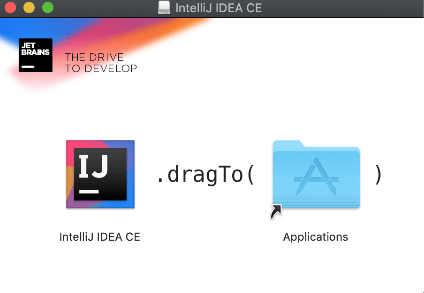

# Install the JDK and IntelliJ IDEA on macOS

To install the JDK and IntelliJ IDEA on your Mac, make sure to follow the instructions closely. Each step must be completed exactly as described in order for the installations to work.

## Install the JDK on macOS

In order to install the Java programming language, you need the JDK. But first you must [create an Oracle account](https://docs.oracle.com/en/cloud/get-started/subscriptions-cloud/csgsg/get-oracle-com-account.html). When you have an account with Oracle, complete the following steps:

1. Navigate to the [JDK download page](https://www.oracle.com/technetwork/java/javase/downloads/jdk8-downloads-2133151.html).

2. Select the "mac OS x64" download option.

3. Click the user agreement and scroll to the bottom, then check the box to accept the agreement.

4. Sign in to your Oracle account.

5. When the download is complete, open the installation files package.

6. When the installation package window pops up, double-click the package icon to launch the install wizard.

7. In the Introduction section of the install wizard, click Continue.

8. The Destination Select section should automatically choose an installation location and redirect you to the next section.

9. In the Installation Type section, click Install.

10. Enter your password in the pop-up prompt, and click Install Software.

11. When the installation is complete, you should see a message that says, "The software was successfully installed."

12. You'll be automatically directed to the Summary Section, which means that you've successfully installed Java!

13. Click the close button, and select "Move to Trash" for the installation files.

14. Open Terminal and run the command `java -version` to check that the installation completed successfully. You can also verify this by opening System Preferences and looking for a Java icon there, as shown in the following image:

`At the bottom of the System Preferences window, the Java icon appears outlined in a red box.`

**Hint**

> For further guidance, watch this [video on installing the JDK for Mac](https://youtu.be/9Bw8vpjYRiA).

## Install the IntelliJ IDEA Community Edition for macOS

Next, you’ll install IntelliJ IDEA to use as your code editor. Complete the following steps:

1. Navigate to the [IntelliJ IDEA download page](https://www.jetbrains.com/idea/download/#section=mac).

2. Download the Community Edition for macOS.

3. Run the disk image file after it downloads.

4. In the Finder window that pops up, drag the IntelliJ IDEA CE icon into your Applications folder, as shown in the following image:

`In the Finder window, the IntelliJ IDEA CE icon appears to the left of the blue Applications folder.`

5. In the Applications folder, open IntelliJ in Launchpad.

6. Click Open when prompted to open a third-party app downloaded from the internet.

7. If prompted to import IntelliJ settings from a config or installation folder, choose the default "Do not import settings" option and click OK.

8. The next step is left to your own discretion! You can either choose to send usage statistics or choose the "Don't send" option to keep from sharing data.

9. Next, you might be prompted to customize IntelliJ IDEA. If so, you can choose to "Skip remaining and set defaults", or you can click through (to set the theme and so on) until you reach the "Start Using IntelliJ" button.

10. Don't forget to eject the install drive and delete the IntelliJ IDEA disk image from your Downloads folder after successful installation.

Great work. You've installed IntelliJ IDEA! Note that on the first launch of IntelliJ IDEA, it might ask you to choose some settings. If so, in the bottom left of that screen, choose the Set Defaults option.

**Hint**

> For further guidance, watch this [video on installing IntelliJ Idea for Mac](https://youtu.be/TYQan9aRAbs).

Phew! Installations can be tedious, but they form essential pillars for everything you'll do going forward.

---
© 2022 edX Boot Camps LLC. Confidential and Proprietary. All Rights Reserved.