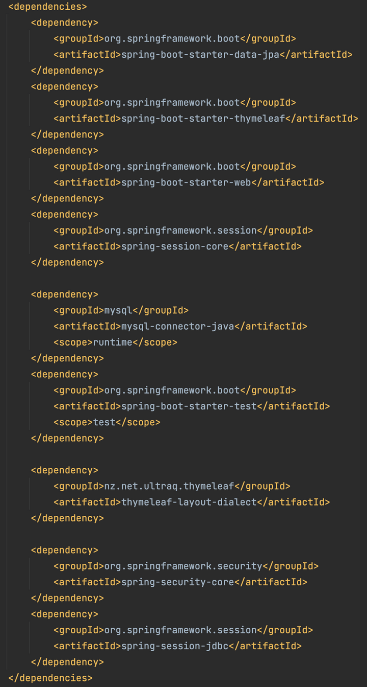

# Manually Add Thymeleaf Layout Dialect and Spring Session JDBC Dependencies

We've already added dependencies with Spring Initializr. However, we also want to incorporate the Spring Security Core, Thymeleaf Layout Dialect, and Spring Session JDBC dependencies—which aren't available in Spring Initializr. Knowing how to add dependencies manually without relying on Initializr is a valuable skill, so this will be good practice!

You can discover and obtain dependency bundles from Maven Central (also known as MVNRepository). This process might remind you of working with Node.js and npm!

To add these dependencies, launch IntelliJ. You might see a welcome screen appear; click on Open and navigate to your `technews` folder to open the project. If you don't see a welcome screen, you can click on the File dropdown menu, then click on Open to navigate to that directory and open the project.

**Deep Dive**

> Learn more about getting started with IntelliJ IDEA, check the [IntelliJ documentation](https://www.jetbrains.com/help/idea/getting-started.html).

Next, open your browser and navigate to the [MVNRepository website](https://mvnrepository.com/repos/central). Once the page loads, search for Thymeleaf Layout Dialect in the search bar at the top center of the page.

When you select Thymeleaf Layout Dialect, you'll see a page displaying the many version options. Click the link for version 2.4.1, and on the next screen you'll see the dependency options. Next, select the Maven tab. This tab will provide the XML version of the dependency that you're looking for, as shown in the following code block:

```xml
<dependency>
  <groupId>nz.net.ultraq.thymeleaf</groupId>
  <artifactId>thymeleaf-layout-dialect</artifactId>
  <version>2.4.1</version>
</dependency>
```

Let's copy the preceding code but remove the `<version> </version>` tags from the XML dependency. Spring Boot will automatically configure the proper version, leaving us with the following snippet:

```xml
<dependency>
  <groupId>nz.net.ultraq.thymeleaf</groupId>
  <artifactId>thymeleaf-layout-dialect</artifactId>
</dependency>
```

Now that we've copied the XML to the clipboard, we need to enter it somewhere—namely, the `pom.xml` file. Open the `pom.xml` file in IntelliJ and add the dependency to the `<dependencies>` section of the file.

Finally, grab the following XML for Spring Security Core and Spring Session JDBC:

```xml
<dependency>
  <groupId>org.springframework.security</groupId>
  <artifactId>spring-security-core</artifactId>
</dependency>
<dependency>
  <groupId>org.springframework.session</groupId>
  <artifactId>spring-session-jdbc</artifactId>
</dependency>
```

Once we've entered all three of the dependencies, the `pom.xml` file should resemble the following image:



`The pom.xml file contains the code for all three dependencies.`

As the image shows, we did add the dependency, but it isn't automatically imported. Let's trigger IntelliJ to import the newly added dependency. We'll do that by navigating to the File dropdown menu (on macOS this is under the "IntelliJ" menu) and selecting Settings (called "Preferences" on macOS). From this menu, select the "Editor > General > Auto Import" tab.

From there, select the "Show auto-import tooltip" and "Add unambiguous imports on the fly" checkbox options (if not already selected). Select "Apply" and close the window. In the `pom.xml` file, a small button with an "m" on it should appear in the upper-right corner of the editor. Click that button to ensure all dependencies are imported. Sometimes it may take reloading the application altogether for the settings to work.

**Deep Dive**

Learn more about these settings in the [IntelliJ documentation](https://www.jetbrains.com/help/idea/settings-auto-import.html#java).

Make sure to push up all of your work to GitHub, using the typical Git workflow, as follows:

```console
git add -A
git commit -m "message"
git push origin main
```

---
© 2022 edX Boot Camps LLC. Confidential and Proprietary. All Rights Reserved.