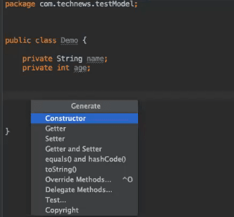

# Create a "Hello, World!" Program in Java

Time for your first adventure in Java—creating a "Hello, World!" program.

To do this, open IntelliJ. In the directory navigator on the left side of the window, select the `src/main/java/com.technews` folder. Then open the File dropdown menu, point the cursor at New, and select Java Class, as shown in the following image:


`In the IntelligJ File drop-down menu, New is highlighted in pink on the left, along with Java Class on the right.`

Name the class `HelloWorld`, and there you go! You’ve created your first class. IntelliJ should open to your newly created `HelloWorld.java` file.

When you create a class, the name of the file must correspond to the name of the class in your code. You named your file `HelloWorld`, so you’ll see that your class is also named `HelloWorld`, as follows:

```java
public class HelloWorld {
}
```

**Deep Dive**

>You’ll see public a lot in Java. The public keyword (as opposed to private) signifies that a method or variable can be accessed by elements in other classes.

>For more information, see the [Oracle documentation on Java](https://docs.oracle.com/en/java/index.html).

You might recall that a **class** in JavaScript is essentially a blueprint that can be used to create new objects, by using the `new` keyword. However, in Java, you'll often use classes for their static properties and methods without creating new objects (although you can also instantiate new objects from them like in JavaScript). This means that you can use classes themselves similarly to how you use objects in JavaScript.

This works because in Java, unlike JavaScript, all of the code must be written inside of a class. There’s no concept of global variables or functions. At least one class in every Java program needs a `main()` method, which serves as an entry point for the program and gets everything started. See the following code for an example:

```java
public static void main(String[] args){}
```

We'll dissect the keywords in this method later. For now, let's add a `main()` method right inside the `HelloWorld` class declaration, as shown in the following example:

```java
public class HelloWorld {
  public static void main(String[] args) {

  }
}
```

Though we aren’t calling this method, it does accept a string array of arguments when the program first starts.

**Rewind**

> Does this remind you of anything in Node.js? It should! The main() method resembles `process.argv` in that it allows us to pass in arguments to the program.

The preceding code is what makes Java a **high-ceremony language**. Whereas in JavaScript we can simply input `console.log("Hello, World!")` and run the code as is, Java requires a bit more work to get to that point.

Okay, now that we've fulfilled those requirements, let’s move on. Inside the `main()` method, add the following code:

```java
public class HelloWorld {
    public static void main(String[] args) {
        System.out.println("Hello, World!");
    }
}
```

Just like `log()` belongs to the `window.console` object in JavaScript, `println()` belongs to the `System.out` object in Java and is used to print messages to the console.

So we have the code necessary to print "Hello, World!" But before we can run it, we need to go through a step called **compilation**. This process involves converting the Java code into **bytecode**, which is readable by the **Java virtual machine (JVM)**. Compilation allows the code we write to be run and understood by any computer with the JVM installed.

In that case, let's start compilation! In IntelliJ IDEA, right-click `HelloWorld.java`, then select "Run `HelloWorld.main()`."

Your code will be compiled and then run. This should open a window in the bottom of your editor that shows the path to the `java.exe` file, the file you're running, and the line you printed: `"Hello, World!"`.

Congratulations, you’ve written your first Java program!

## Create a VariableTypes Project

Now we'll create another demo project that will help us explore some of the primary differences between Java and JavaScript, particularly regarding variables.

You might recall that JavaScript is dynamically typed. This means that a variable can hold one type of data (like a Boolean) at first but can later hold another type of data (like a string), as follows:

```javascript
var isFavorite = false;
isFavorite = "not really";=
```

As a **dynamically typed** language, JavaScript allows for more flexibility in variable declaration and return typing. But it also requires the computer to do a lot of value-definition checking when the program runs.

Java, on the other hand, is a **statically typed** language. This means that when you declare a variable, you must tell the computer what type of data it will hold, and that can never change. See the following code for an example:

```java
boolean isFavorite = false;
String favString = "not really";
```

So although JavaScript allows for more flexibility, Java offers greater efficiency due to its rigid requirements for declaring variables. Let’s discover how to harness this powerful characteristic of Java.

Using the same process as the `HelloWorld` project, create a new project called `VariableTypes`. Then create an associated class with the same name. Add the `main()` method to the class, as follows:

```java
public class VariableTypes {
 public static void main(String[] args) {

  }
}
```

Now we can explore the various data types inside the `main()` method. Java includes many built-in types, but for now we'll focus on the following:

* The `String` keyword indicates a string of characters, as shown in the following example:

```java
String name = "Cleopatra";
```

* The `int` keyword indicates whole numbers (or integers, like 1, 2, or 3), as follows:

```java
int age = 2016 + 69;
```

* The `double` data type stores decimal values (like 1.2, 2.3, or 3.54), as shown in the following example:

```java
double price = 1999.99;
```

* A `boolean` data type stores Boolean values (either true or false), as shown in the following example:

```java
boolean truth = true;
boolean falseness = !truth;
```

Let's practice a bit before we move on to generating constructors, getters and setters, and other methods.

## Create a VariablesPractice Project

Using the same process that you did for the `HelloWorld` and `VariableTypes` projects, create a new project called `VariablesPractice`. Like you've done before, create a new class with a `main()` method.

Inside the `main()` method, complete the following steps and answer the questions. Try different types for each question until you can figure it out.

* Create two variables—one `int` and one `double`. Add them together to find the sum, and store the result as a variable called `sum`. What type is `sum`?

* Create a `String` variable. Add it to your `int` and store the result as a variable. What type is it?

* When you think you know the data types of the resultant variables, use `System.out.println` to check the values.

* Is `sum` a whole number or a decimal value?

    * Decimal value, as `b` is a decimal value.

* Now compare these results to JavaScript. What happens when we add a string and a number together in JavaScript?

    * The string and number will be concatenated (as in `4 + cat = 4cat`). See the following code block for an example:

```java
public class VariablesPractice {

  public static void main(String[] args) {

    int a = 4;
    double b = 3.5;
    String c = "cat";

    // calculated variable sum is a double
    double sum = a + b;

    // calculated variable concat is a String
    String concat = a + c;

    // value of sum is 7.5
    System.out.println(sum);

    // value of concat is "4cat"
    System.out.println(concat);

  }
}
```

Great job!

## Create a testModel.Demo Class

Now you'll practice creating constructor functions. Remember, a **constructor function** creates objects based on a class blueprint. You've done this before in JavaScript—in Java, IntelliJ IDEA can generate constructor functions for instance variables! As you work through this demo, you'll get a peek at how creating entity models will look.

First, delete the `HelloWorld` class from earlier, found in the file navigation on the left side of the IDE. After it's deleted, select `src/main/java/com.technews`. From the File dropdown menu, select New. Then select Class, and name the new class `testModel.Demo`.

Inside your `Demo` class, create private `String` and `int` instance variables, as follows:

```java
public class Demo {

  private String name;
  private int age;

}
```

Awesome! Now right-click anywhere between the opening and closing curly brackets of your `Demo` class, and press Generate. This should display a list of options, as shown in the following image:



`Inside the Demo class, the user has clicked Generate, resulting in a drop-down list of options, with Constructor highlighted at the top.`

Let's select Constructor in this case. Then we'll be prompted to "Choose Fields to Initialize by Constructor". We want to use both the name and age fields, so highlight them by holding down `Shift` and clicking on both options. Then select OK, as shown in the following image:


`In the menu to "Choose Fields to Initialize by Constructor, both name:String and age:int are highlighted.`

You'll notice that the generated constructor has the same name as the class that it was derived from and that the method has NO return type. That is, there is no type before `Demo` and after `public` in the constructor definition, as shown in the following example:

```java
public Demo(String name, int age) {
  this.name = name;
  this.age = age;
}
```

Now that we've generated the constructor via IntelliJ IDEA, let's generate some getters and setters!

## Generate Getters and Setters for the Demo Class

Private variables can only be accessed from within the same class where they were created and initialized. However, we can circumvent that rule by using getters and setters. Getters and setters access private variables using public `get()` and `set()` methods. The `get()` method returns the variable value, while the `set()` method allows us to set the value.

To create some basic getters and setters, right-click below your constructor inside the `Demo` class. Like you did for the constructors, select Generate. You'll see individual "Getters" and "Setters" options, but you'll want to choose the combined "Getters and Setters" option.

At that point, you'll be prompted to "Select Fields to Generate Getters and Setters". Choose both the `name` and `age` variables and press OK.

You should see the following code generated in the `Demo` class:

```java
public String getName() {
  return name;
}

public void setName(String name) {
  this.name = name;
}

public int getAge() {
  return age;
}

public void setAge(int age) {
  this.age = age;
}
```

As shown in this example, the name of each method is preceded first by `public` or `private` and then by a return type. Let's say that the method returns a string; in that case, the line of code would be `public String getName()`. If the method doesn't need to return a value, then we can use the `void` keyword in place of a return type.

Then, just like in JavaScript, you can name your function and specify the type as well as the identifier of the arguments you'd like—for example, `setName(String name)`. You can comma-separate your arguments and have more than one, but unlike JavaScript, they do require a type. Similar style, different rules!

## Generate equals(), hashCode(), and toString() Methods for the Demo Class

We're almost ready to write the actual code for Just Tech News. But first let's do a final round of practice. To start, we'll add the `equals()` and `hashCode()` methods to the `Demo` class.

Spring Data JPA will use the `equals()` method to compare two objects. However, this method compares objects by **hash code** (or reference number), rather than by value. Thus, two distinct objects with the same value would be interpreted as NOT equal. We'll override that functionality so that `equals()` compares objects based on values, but we'll also need to override `hashCode()` when we do that because it is closely linked.

To create these methods, right-click under your getters and setters but inside your `Demo` class. Select Generate. This will bring up a prompt. Just click "next" all the way through! When you're done, the code for `equals()` and `hashCode()` will look like the following example:

```java
@Override
public boolean equals(Object o) {
  if (this == o) return true;
  if (o == null || getClass() != o.getClass()) return false;
  Demo demo = (Demo) o;
  return age == demo.age &&
    Objects.equals(name, demo.name);
}

@Override
public int hashCode() {
  return Objects.hash(name, age);
}
```

Finally, let's generate a `toString()` method using IntelliJ. By default, `toString()` returns the reference number of an object—but wouldn't it be more useful to view the actual value of an object, rather than just its reference number?

In the same way that we overrode the default functionality for the `equals()` and `hashCode()` methods, we can also override `toString()` to change its behavior. When we're done, we'll be able to view the value of an object within the log file.

Right-click under the `hashCode()` closing bracket, and select Generate. Then select `toString()`. The generated code should look like the following example:

```java
@Override
  public String toString() {
    return "Demo{" +
            "name='" + name + '\'' +
            ", age=" + age +
            '}';
  }
  ```

You might have noticed the `@Override` annotation at the top of each of the methods we just generated. You'll learn more about annotations soon. When you see the `@Override` annotation on a method, it means that the method is coming to the class from a superclass (or parent class). In this case, that superclass is the `Object` class.

**Note**

> The `@Override` annotation isn't required, but it is best practice to include it.

Wow! We've covered a lot of new concepts in these practice exercises. Now we're prepared to write some real code. Let's delete the tes`tModel folder and `Demo` class and start creating the first entity model for the project.

---
© 2022 edX Boot Camps LLC. Confidential and Proprietary. All Rights Reserved.