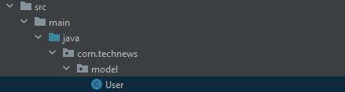

# Create the User Entity Model

When we created the Spring Boot project for this application, we included the Spring Data JPA dependency bundle. In Spring Data JPA, entity models serve as the blueprints for database tables and columns. We'll use the Spring Data JPA for table creation, primary key creation and auto-generation, foreign key constraint and table relationship creation, column creation, and data validations.

**Pro Tip**

> You might have noticed that the driving force behind Spring is to provide a framework of libraries that can simplify and streamline common tasks. This facilitates standardization of structure and process across Java, enabling developers to tackle certain tasks quickly and easily.

Wow, the Spring Data JPA does a lot! We can achieve all this functionality by using **annotations**, or metadata about a project. Annotations are available at the following levels:

* **Class-level annotations** are declared above a class.

* **Instance variable-level annotations** are declared above the instance variables.

* **Method-level annotations** are declared above the methods.

Basically, the level of the annotation determines how much of an effect it will have on the code. Based on the annotations we use and their placement throughout the entity model classes, the Spring framework will decide which libraries to pull in and how to configure them.

Okay, so let's use this knowledge to build the `User` entity model. This is a basic **POJO** (or **plain old Java object**) class, and it is structurally no different from the demo classes that we created earlier. To begin, navigate to IntelliJ IDEA and create a new package (Java terminology for project folders) called `model` inside `src/main/java/com.technews`. Then, inside the `model` package, create a new class called `User`, as shown in the following example:



`In the folder tree, the new User class appears nested inside the model package.`

## Create the Class-Level Annotations for the User Class

We'll start writing annotations at the class level and then work downward. Add the following three annotations above `public class User{}`:

```java
@Entity
@JsonIgnoreProperties({"hibernateLazyInitializer", "handler"})
@Table(name = "user")
```

After you add those annotations, the code should look like the following example:

```java
package com.technews.model;


import com.fasterxml.jackson.annotation.JsonIgnoreProperties;
import javax.persistence.Entity;
import javax.persistence.Table;

@Entity
@JsonIgnoreProperties({"hibernateLazyInitializer", "handler"})
@Table(name = "user")
public class User {
    
}
```

**Note**

> Ideally, import statements should be automatically generated at the top of the file, since we selected "Add unambiguous imports on the fly" in the last lesson. If you don't see these statements, you can import an annotation (or any other Java element) by clicking on it, entering Option+Return (macOS) or Alt+Enter (Windows) on your keyboard, and selecting the correct package to import from.

Here's a brief overview of the annotations you've just added:

* `@Entity` marks this as a persistable object, so that the `User` class can map to a table.

* `@JsonIgnoreProperties` specifies properties that should be ignored when serializing this object to JSON. The two arguments that follow the annotation are the properties to be ignored. Note that you could add many more if necessary.

* `@Table` specifies the name of the table that this class maps to. If this annotation isn't present, the table name will be the class name by default.

## Create the Instance Variable-Level Annotations for the User Class

With the class created, along with its class-level annotations, we can start adding instance variables. We'll create eight instance variables: `id`, `username`, `email`, `password`, `loggedIn`, `posts`, `votes`, and `comments`. Of those, the `posts`, `votes`, and `comments` instance variables will be **lists**—collections of objects of the same type. Add the following code to create these instance variables:

```java
public class User {
  private Integer id;
  private String username;
  private String email;
  private String password;
  boolean loggedIn;

  private List<Post> posts;
  private List<Vote> votes;
  private List<Comment> comments;
  
}
```

Excellent! Now for the proper instance-level annotations. First, we want to attach the `@Id` and `@GeneratedValue` annotations to the id private variable. The first signals that `id` will be used as the unique identifier, and the second denotes that it will be a generated value. We'll pass an argument into `@GeneratedValue` to say that this number should be generated automatically, by adding `(strategy = GenerationType.AUTO)`.

You can use the following code to do all that:

```java
@Id
@GeneratedValue(strategy = GenerationType.AUTO)
private Integer id;
```

Now let's add the annotation `@Column(unique = true)` to `email`, to signal that this value must be unique; duplicates won't be allowed. With that, the `email` variable should look like the following example:

```java
@Column(unique = true)
private String email;
```

Finally, we'll add `@Transient` to the `loggedIn` variable. `@Transient` signals to Spring Data JPA that this data is NOT to be persisted in the database, because we don't need or want a user's logged-in status to persist in the data. This annotation will look like the following example:

```java
@Transient
boolean loggedIn;
```

## Create Table Relationships for the User Class

Next we need to create relationships for the tables in the database. Remember one-to-many relationships in SQL? Well, in Java, we can use an annotation called `@OneToMany`, which will create the relationships between the tables automatically.

Above each of the list variables (`posts`, `votes`, and `comments`), add the `@OneToMany` annotation and three arguments, as follows:

```java
@OneToMany(mappedBy = "userId", cascade = CascadeType.ALL, fetch = FetchType.EAGER)
private List<Post> posts;

// Need to use FetchType.LAZY to resolve multiple bags exception
@OneToMany(mappedBy = "userId", cascade = CascadeType.ALL, fetch = FetchType.LAZY)
private List<Vote> votes;

// Need to use FetchType.LAZY to resolve multiple bags exception
@OneToMany(mappedBy = "userId", cascade = CascadeType.ALL, fetch = FetchType.LAZY)
private List<Comment> comments;
```

Note that the `Posts` variable gets the `FetchType` of `EAGER`, meaning that this list will gather all of its necessary information immediately after being created, while the variables designated as `LAZY` only gather information as they need it. You can only ever designate a single list as `EAGER`.

## Generate the Methods for the User Class

Now that you have all of the instance variables, you can generate the `User` class constructor, getters and setters, and `equals()`, `hashCode()`, and `toString()` methods. Create all of those, being sure to include all of the instance variables.

Finally, let's make this class implement an interface called `Serializable`. In our next lesson, we'll go more in-depth with interfaces and the `implements` keyword, but for now, just make sure we add `implements Serializable` after `public class User`.

By implementing Serializable, we inform the Java Virtual Machine that this model will be "serialized", or coverted into a bytestream in order to store entries for these models in a database. Java handles this process for us under the hood, so other than making sure to implement the inferface in each of your entity models, you won't need to worry more about serialization when buidling this app.

By the end, your code should resemble the following example:

```java
package com.technews.model;

import com.fasterxml.jackson.annotation.JsonIgnoreProperties;

import javax.persistence.*;
import java.io.Serializable;
import java.util.List;
import java.util.Objects;

@Entity
@JsonIgnoreProperties({"hibernateLazyInitializer", "handler"})
@Table(name = "user")
public class User implements Serializable {

@Id
@GeneratedValue(strategy = GenerationType.AUTO)
private Integer id;
private String username;
@Column(unique = true)
private String email;
private String password;
@Transient
boolean loggedIn;

@OneToMany(mappedBy = "userId", cascade = CascadeType.ALL, fetch = FetchType.EAGER)
private List<Post> posts;

// Need to use FetchType.LAZY to resolve multiple bags exception
@OneToMany(mappedBy = "userId", cascade = CascadeType.ALL, fetch = FetchType.LAZY)
private List<Vote> votes;

// Need to use FetchType.LAZY to resolve multiple bags exception
@OneToMany(mappedBy = "userId", cascade = CascadeType.ALL, fetch = FetchType.LAZY)
private List<Comment> comments;

public User() {
}

public User(Integer id, String username, String email, String password) {
  this.id = id;
  this.username = username;
  this.email = email;
  this.password = password;
}


public Integer getId() {
  return id;
}

public void setId(Integer id) {
  this.id = id;
}

public String getUsername() {
  return username;
}

public void setUsername(String username) {
  this.username = username;
}

public String getEmail() {
  return email;
}

public void setEmail(String email) {
  this.email = email;
}

public String getPassword() {
  return password;
}

public void setPassword(String password) {
  this.password = password;
}

public boolean isLoggedIn() {
  return loggedIn;
}

public void setLoggedIn(boolean loggedIn) {
  this.loggedIn = loggedIn;
}

public List<Post> getPosts() {
  return posts;
}

public void setPosts(List<Post> posts) {
  this.posts = posts;
}

public List<Vote> getVotes() {
  return votes;
}

public void setVotes(List<Vote> votes) {
  this.votes = votes;
}

public List<Comment> getComments() {
  return comments;
}

public void setComments(List<Comment> comments) {
  this.comments = comments;
}

@Override
public boolean equals(Object o) {
  if (this == o) return true;
  if (!(o instanceof User)) return false;
  User user = (User) o;
  return isLoggedIn() == user.isLoggedIn() &&
        Objects.equals(getId(), user.getId()) &&
        Objects.equals(getUsername(), user.getUsername()) &&
        Objects.equals(getEmail(), user.getEmail()) &&
        Objects.equals(getPassword(), user.getPassword()) &&
        Objects.equals(getPosts(), user.getPosts()) &&
        Objects.equals(getVotes(), user.getVotes()) &&
        Objects.equals(getComments(), user.getComments());
  }

@Override
public int hashCode() {
  return Objects.hash(getId(), getUsername(), getEmail(), getPassword(), isLoggedIn(), getPosts(), getVotes(), getComments());
}

@Override
public String toString() {
  return "User{" +
          "id=" + id +
          ", username='" + username + '\'' +
          ", email='" + email + '\'' +
          ", password='" + password + '\'' +
          ", loggedIn=" + loggedIn +
          ", posts=" + posts +
          ", votes=" + votes +
          ", comments=" + comments +
          '}';
  }
}
```

Wow, look at all that code! IntelliJ generated a lot of it, and the annotations also offer extensive functionality—with little effort from us.

You might have noted we provided two constructors for `Post`—one with arguments and one without. We'll do the same for all of our entity models, and we'll use both of them in the controller classes that we'll create later. By default, if we don't provide any constructors at all, Java will automatically generate a constructor that does not take arguments. However, if we provide a constructor that does use arguments, the Java compiler won't generate a no-argument constructor, meaning we need to write both if we need to use them.

We aren't finished yet, though! We need to create three more entity models for this project: `Comment`, `Post`, and `Vote`. So let's get back to work.

---
© 2022 edX Boot Camps LLC. Confidential and Proprietary. All Rights Reserved.