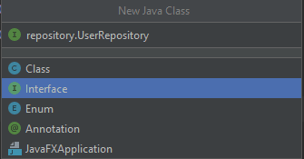

# Create the Entity Model Repositories

First we'll create the repository interfaces for each entity model. An **interface** in Java is an abstract class that groups related empty methods. To access these methods, one of the classes has to use the `implement` keyword (instead of a keyword like `extends` that indicates inherited behavior).

When we made classes previously, we were basically creating blueprints by which we could produce objects. In contrast, a Java interface resembles a contract more than a blueprint. The interface itself can do nothing on its own. Instead, it defines the methods that an implementing class MUST account for.

So if we create an interface named `Movement` that includes a method named `run()` and another method named `jump()`, then any class that implements that interface MUST include both a `run()` and a `jump()` method. The class that implements the interface will have the method body, which dictates how that class will specifically implement the `run() `and `jump()`. So a `Dog` class implements the `Movement` interface and provides the specifics of how a dog runs and jumps. Then a `Cat` class would implement the `Movement` interface and provide its own specific run() and `jump()` movements for a cat. In the end, you're assured that both `Dog` and `Cat` have those methods, but each class can implement the methods in a way specific to that class.

To demonstrate all this in action, let's create this `Movement` interface, as shown in the following example:

```java
Interface Movement {
  public void run();
  public void jump();
}

class Dog implements Movement {
  public void run() {
    System.out.println("This dog can run a long time!");
  }

  public void jump() {
    System.out.println("This dog can't jump very high!");
  }
}

class Cat implements Movement {
  public void run() {
    System.out.println("This cat can run really fast!");
  }

  public void jump() {
    System.out.println("This cat jump really high!");
  }
}
```

As shown in the preceding code, we created two empty methods (`run()` and `jump()`) within the interface named `Movement`. We then implemented that interface in both of the classes in two different ways. Remember, in order to implement an interface, a class must use all of the methods contained within that interface.

## Create the User Repository Interface

Great! Now you'll create the first interface for Just Tech News. In IntelliJ IDEA, click `src/main/java/com.technews`. Select File, New, and then Java Class. Select Interface on the menu that pops up. You'll want to create the `UserRepository` inside of a package named repository. Type `repository.UserRepository`, as shown in the following image, and press Enter:



`Under New Java Class, the Interface option is highlighted, and the user has entered repository.UserRepository at the top.`

Okay, now you should be taken to your newly created `UserRepository` interface. The code should look like the following example:

```java
package com.technews.repository;

public interface UserRepository {

}
```

Let's add the class-level annotation `@Repository`. A **repository** in Java is any class that fulfills the role of a **data access object (DAO)**—in other words, it contains data retrieval, storage, and search functionality.

Even though the repository CRUD methods and SQL aren't visible in the interface, we'll ensure that the methods are still available via **inheritance**. To do that, we need to alter the `public interface UserRepository` statement to extend the `JpaRepository`—thus, the interface will inherit the methods used to access the database for standard CRUD operations. Those methods will be available to any class that autowires the repository, like the controller classes that we'll create later that will perform the CRUD operations.

**Note**

> The term **autowiring** refers to scanning a project and instantiating only the objects required for a class or method to run.

To ensure that the repository can take `User` (from the entity model we created) and the id of that user, we specify an `Integer`. Now the code should resemble the following example:

```java
package com.technews.repository;

import com.technews.model.User;
import org.springframework.data.jpa.repository.JpaRepository;
import org.springframework.stereotype.Repository;

@Repository
public interface UserRepository extends JpaRepository<User, Integer> {

    
}
```

Finally, let's add the custom query method, which we'll call `findUserByEmail()`. This method will allow us to do what the name implies—find users by their email. Naming methods in this specific way allows Spring Data JPA to write the SQL for that method based solely on the name. The following example shows what the `findUserByEmail()` method should look like:

```java
User findUserByEmail(String email) throws Exception;
```

So the final `Interface` file should look like the following example:

```java
package com.technews.repository;

import com.technews.model.User;
import org.springframework.data.jpa.repository.JpaRepository;
import org.springframework.stereotype.Repository;

@Repository
public interface UserRepository extends JpaRepository<User, Integer> {
  User findUserByEmail(String email) throws Exception;
}
```

Excellent! You just created your first interface. Now you need to make three more, corresponding to the `Post`, `Comment`, and `Vote` classes.

## Create the Post Repository Interface

You'll tackle the `Post` repository next. Create a new interface and name it `PostRepository`. Add the same `@Repository` class-level annotation, and extend the `JpaRepository` just like you did for the `UserRepository`. But instead of `<User, Integer>`, use `<Post, Integer>`.

We also need to create the query method, named `findAllPostsByUserId(Integer id)`. The return type will be `List<Post>`, so the final code should look like the following example:

```java
package com.technews.repository;

import com.technews.model.Post;
import org.springframework.data.jpa.repository.JpaRepository;
import org.springframework.stereotype.Repository;

import java.util.List;

@Repository
public interface PostRepository extends JpaRepository<Post, Integer> {

  List<Post> findAllPostsByUserId(Integer id) throws Exception;

}
```

## Create the Comment Repository Interface

Great, now do the same for the `CommentRepository`. Follow all the steps you took previously—but instead of `<Post, Integer>,` use `<Comment, Integer>`. The method within the interface, named `findAllCommentsByPostId()`, will take a return type of `List<Comment>` and take an argument `postId` of value `int`.

The code in your `CommentRepository` file should look like the following example:

```java
package com.technews.repository;

import com.technews.model.Comment;
import org.springframework.data.jpa.repository.JpaRepository;
import org.springframework.stereotype.Repository;

import java.util.List;

@Repository
public interface CommentRepository extends JpaRepository<Comment, Integer> {

    List<Comment> findAllCommentsByPostId(int postId);
}
```

Nice work! We only have a single interface left to create now.

## Create the Vote Repository Interface

The `Vote` interface will differ a little from the other three. First, we won't add the `@Repository` class-level annotation but instead will add an instance-level annotation, `@Query`. Second, we'll add `<Vote, Integer>` to the ` extendsJpaRepository<>`, adding a bit more specificity to the query that will be structured from the interface.

Let's set up the skeleton of the interface, as follows:

```java
package com.technews.repository;

public interface VoteRepository extends JpaRepository<Vote, Integer> {

}
```

Next, for the body of the interface, let's add a method named `countVotesByPostId()` with a return type of `int`. This method will have two arguments—one is a method-level annotation of `@Param("id)`, to use the id as a parameter, and the other is the `Integer id`. So the code should look like the following example:

```java
package com.technews.repository;

import com.technews.model.Vote;
import org.springframework.data.jpa.repository.JpaRepository;
import org.springframework.data.repository.query.Param;

public interface VoteRepository extends JpaRepository<Vote, Integer> {

  int countVotesByPostId(@Param("id") Integer id);

}
```

Next, let's add the instance-level annotation, `@Query`, right above the method we just declared. This annotation will take a single argument, which will be the specific query we want to use (`"SELECT count(*) FROM Vote v where v.postId = :id"`). With that, the code should look like the following example:

```java
package com.technews.repository;

import com.technews.model.Vote;
import org.springframework.data.jpa.repository.JpaRepository;
import org.springframework.data.jpa.repository.Query;
import org.springframework.data.repository.query.Param;

public interface VoteRepository extends JpaRepository<Vote, Integer> {

  @Query("SELECT count(*) FROM Vote v where v.postId = :id")
  int countVotesByPostId(@Param("id") Integer id);

}
```

Nice work! You've created all of your repository interfaces—and the contracts by which your classes will implement these methods. You can move on to configuring the datasource, Spring session, and port number for the API so that you can get testing.

Make sure that all of your work is pushed up to GitHub, using the following Git workflow:

```console
git add .
git commit -m "message"
git push origin main
```

---
© 2022 edX Boot Camps LLC. Confidential and Proprietary. All Rights Reserved.