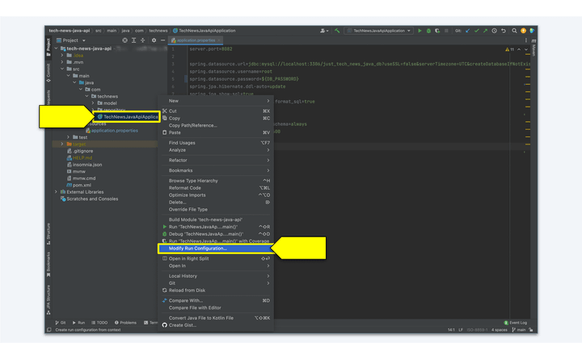
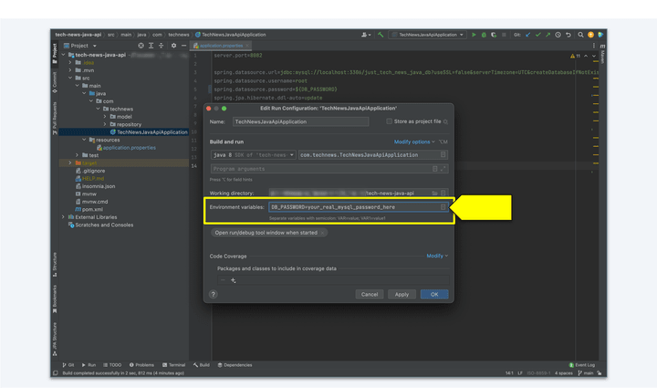

# Set Local Environment Variables in IntelliJ

Let's set up an environment variable to contain our password in IntelliJ. First, right-click on the `TechNewsJavaApiApplication.java` file under `technews` on IntelliJ's file explorer, then select "Modify Run Configuration...".



`A menu which appears when right-clicking on TechNewsJavaApiApplication.java in the IntelliJ file explorer, with "Modify Run Configuration..." highlighted.`

Then, enter an environment variable in the "Environment variables:" input box. We'll use the same format as we used in our .env files in Node.js—that is, an all-caps key, followed by and equals sign and our actual database password on the right of the equals sign. It should look something like this:

```java
DB_PASSWORD=your_real_mysql_password_here
```



`The "Edit Run Configuration" control panel, with "Environment variables" input box highlighted.`

Click on Apply, then OK to save the environment variable. That's it!

---
© 2022 edX Boot Camps LLC. Confidential and Proprietary. All Rights Reserved.