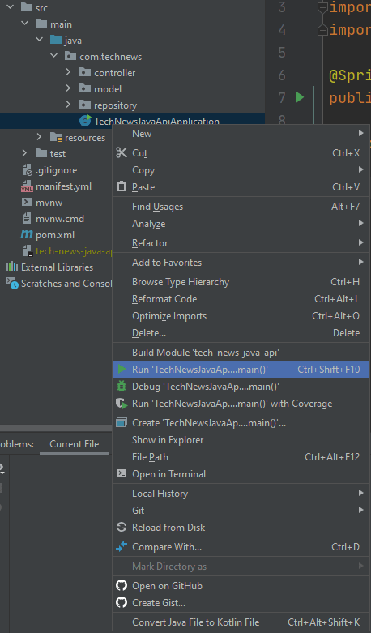
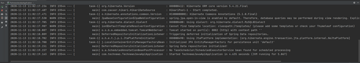
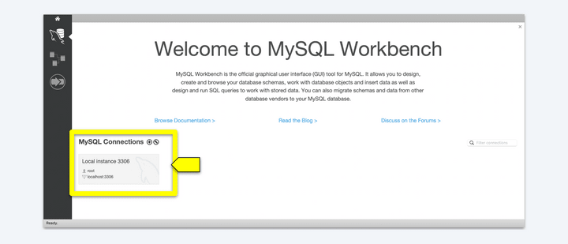
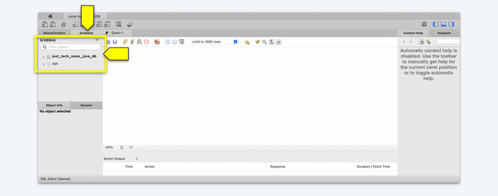
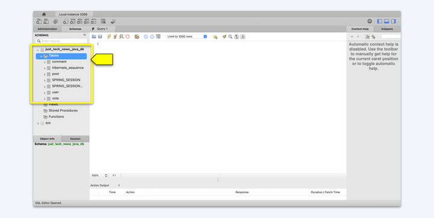

# Start Up the Java API and Confirm Database Table Creation

So far we haven't had to test anything for this project. Unlike JavaScript, Java programs have to go through a build process before they're executed. But now we've completed that process, and it's time to actually compile and run the Java API to verify that it's functioning.

As we've discussed previously, all Java applications are executed through a `main()` function. The `main()` function is essential to starting any Java app; without it, the program would fail instantly.

When we generated this project with Spring Intitializr, a class called `TechNewsJavaApiApplication` was created. It can be found in the `src` folder, nested inside `main`, `java`, and `com.technews`. Open this file in IntelliJ IDEA. It should resemble the following code:

```java
package com.technews;

import org.springframework.boot.SpringApplication;
import org.springframework.boot.autoconfigure.SpringBootApplication;

@SpringBootApplication
public class TechNewsJavaApiApplication {

  public static void main(String[] args) {
    SpringApplication.run(TechNewsJavaApiApplication.class, args);
  }

}
```

The body of the `main()` function contains an autogenerated function that will spin up the API for us, using the `run()` method. Right-click the `TechNewsJavaApiApplication` class in the file navigator of IntelliJ IDEA, then select `Run main()`, as shown in the following image:



`In the IntelliJ IDEA file tree, TechNewsJavaApiApplication is selected, along with "Run TechNewsJavaAp...main()"`

Once you click Run, an integrated log should open at the bottom, showing you the processes being run and the current state of the application. Once the build is complete and the application starts up, you should see something like the following image:



`An integrated log comprising several lines displays all processes being run.`

Awesome! Let's just confirm that the API actually created the database and tables as expected. Open MySQL Workbench, then open the localhost connection, as shown in the following image:



`Under MySQL Connections, a box labeled "Local instance MySQL80" displays the root and localhost:3306.`

Next, near the center on the left side, choose the Schemas tab (next to Administration), as shown in the following image:



`In the Schemas tab of the MySQL Workbench, a red arrow points at the just_tech_news_java_db schema.`

Great—you can see `just_tech_news_java_db` in the list of databases! Finally, click the arrow to show the tables. You'll see all the tables that you set up via the entity models, as shown in the following image:



`Under just_tech_news_java_db, all the tables set up via the entity models are listed.`

The API is running, and the database and associated tables—including all of the necessary relationships—have been created. That's worth celebrating!

---
© 2022 edX Boot Camps LLC. Confidential and Proprietary. All Rights Reserved.