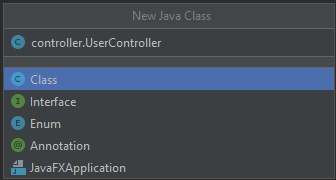

# Create the Server-Side CRUD Controllers

You probably recall that **CRUD** refers to the four basic functions of persistent storage: **create**, **read**, **update**, and **delete**. You'll create a controller to handle each of these methods for the API; each one will be associated with a model that you've created already. Essentially, the controllers give functionality to the models.

With that in mind, let's make the first controller!

## Create the UserController

Navigate to IntelliJ. In the left-hand file navigation, select the `com.technews` package, which will be nested in the `src` folder, under `main` and then `java`. Create a new Java class like you've done before. Name the new class `controller.UserController`, as shown in the following image:



`Under New Java Class, the Class option is highlighted, and the user has entered controller.UserController at the top.`

The code for this new class should look like the following example:

```java
package com.technews.controller;

public class UserController {
   
}
```

For this class, we'll use a Spring annotation called `@RestController` that will allow it to process JSON/XML responses and send JSON/XML objects via the API—which will be vital for the controller's functionality. With that annotation, the basic class should look like the following example:

```java
package com.technews.controller;

import org.springframework.web.bind.annotation.RestController;

@RestController
public class UserController {

}
```

Excellent. Now let's add the CRUD methods that will allow us to actually create, read, update, and delete information to and from the database! Copy and paste the following code into the controller:

```java
@Autowired
UserRepository repository;

@Autowired
VoteRepository voteRepository;

@GetMapping("/api/users")
public List<User> getAllUsers() {
  List<User> userList = repository.findAll();
  for (User u : userList) {
    List<Post> postList = u.getPosts();
    for (Post p : postList) {
        p.setVoteCount(voteRepository.countVotesByPostId(p.getId()));
    }
  }
  return userList;
}

@GetMapping("/api/users/{id}")
public User getUserById(@PathVariable Integer id) {
  User returnUser = repository.getById(id);
  List<Post> postList = returnUser.getPosts();
  for (Post p : postList) {
    p.setVoteCount(voteRepository.countVotesByPostId(p.getId()));
  }

  return returnUser;
}

@PostMapping("/api/users")
public User addUser(@RequestBody User user) {
  // Encrypt password
  user.setPassword(BCrypt.hashpw(user.getPassword(), BCrypt.gensalt()));
  repository.save(user);
  return user;
}

@PutMapping("/api/users/{id}")
public User updateUser(@PathVariable int id, @RequestBody User user) {
  User tempUser = repository.getById(id);

  if (!tempUser.equals(null)) {
    user.setId(tempUser.getId());
    repository.save(user);
  }
  return user;
}

@DeleteMapping("/api/users/{id}")
@ResponseStatus(HttpStatus.NO_CONTENT)
public void deleteUser(@PathVariable int id) {
  repository.deleteById(id);
}
```

Okay, that's a lot of code. Let's break it down and review all the different pieces, starting with Spring-specific annotation:

* The `@Autowired` annotation tells Spring to scan the project for objects that will need to be instantiated for a class or method to run. Unlike the `new` operator, which instantiates all objects before they're necessarily needed, `@Autowired` informs Spring to only instantiate each object as needed by the program. Then it can grab and inject the proper dependencies without having to manually wire anything in the XML. This form of dependency injection improves efficiency and keeps the program light.

Now we'll review the GET requests, as follows:

* The `@GetMapping("/api/users")` annotation on the `getAllUsers()` method combines the route `("/api/users")` and the type of HTTP method used (GET), providing the method with a unique endpoint.

* In the body of the `getAllusers()` method, we set the return type to `List<User>`, because we want it to return a list of users.

**Note**

> Remember, all methods without the `void` keyword must have a return type.

* Calling the inherited `findAll()` method on the `repository` object, we can get a list of users and assign it to the `userList` variable.

* Next we call the `getPosts()` function for every `User`, assigned to the variable `u` inside `userList`. That function won't work until we finish setting up the `PostController`. At that point, we'll iterate over each post, invoking the `setVoteCount()` method, passing in the `countVotesByPostId()` method, and finally using `getId()` to obtain the id of the post.

* Instead of returning a list, the `getUserById()` method will only return a single user.

Let's move on to the POST requests, as follows:

* The `addUser()` method that's annotated with `PostMapping("/api/users")` will allow us to add a user to the database. Inside the definition of the `addUser()` method, we pass in the `@RequestBody` annotation—which will map the body of this request to a transfer object, then deserialize the body onto a Java object for easier use.

* The `setPassword()` method offers protection to users. We'll use `BCrypypt` to encrypt the passwords for new users. After encryption, we save the new `user` and then return the newly created `user`.

The final two routes (PUT and DELETE) are straightforward:

* The `updateUser()` method (annotated by `@PutMapping`) allows us to update a user based on a specific id. The `@PathVariable` will allow us to enter the int id into the request URI as a parameter, replacing the `/{id}` in `@PutMapping("/api/users/{id}"`).

* Lastly, for DELETE, we use the `@PathVariable` to pass in an int to the request URI. Then, based on that specific id, we'll delete the associated user.

Wow, we've completed a lot of work at this point! We just need to set up the `PostController` and the `CommentController`, and then we can run some tests via Insomnia. The code for each controller is pretty similar, so you can take the code provided and enter it into the newly created class.

## Create the PostController

Let's create the `PostController` first. On the left-hand file navigation of IntelliJ, select the `controller` package and create a new class called `PostController`. Copy and paste the following code into your newly created class file:

```java
package com.technews.controller;

import com.technews.model.Post;
import com.technews.model.User;
import com.technews.model.Vote;
import com.technews.repository.PostRepository;
import com.technews.repository.UserRepository;
import com.technews.repository.VoteRepository;
import org.springframework.beans.factory.annotation.Autowired;
import org.springframework.http.HttpStatus;
import org.springframework.web.bind.annotation.*;

import javax.servlet.http.HttpServletRequest;
import java.util.List;

@RestController
public class PostController {

  @Autowired
  PostRepository repository;

  @Autowired
  VoteRepository voteRepository;

  @Autowired
  UserRepository userRepository;

  @GetMapping("/api/posts")
  public List<Post> getAllPosts() {
    List<Post> postList = repository.findAll();
    for (Post p : postList) {
      p.setVoteCount(voteRepository.countVotesByPostId(p.getId()));
    }
    return postList;
  }


  @GetMapping("/api/posts/{id}")
  public Post getPost(@PathVariable Integer id) {
    Post returnPost = repository.getById(id);
    returnPost.setVoteCount(voteRepository.countVotesByPostId(returnPost.getId()));

    return returnPost;
  }


  @PostMapping("/api/posts")
  @ResponseStatus(HttpStatus.CREATED)
  public Post addPost(@RequestBody Post post) {
    repository.save(post);
    return post;
  }


  @PutMapping("/api/posts/{id}")
  public Post updatePost(@PathVariable int id, @RequestBody Post post) {
    Post tempPost = repository.getById(id);
    tempPost.setTitle(post.getTitle());
    return repository.save(tempPost);
  }


  @PutMapping("/api/posts/upvote")
  public String addVote(@RequestBody Vote vote, HttpServletRequest request) {
    String returnValue = "";

    if(request.getSession(false) != null) {
      Post returnPost = null;

      User sessionUser = (User) request.getSession().getAttribute("SESSION_USER");
      vote.setUserId(sessionUser.getId());
      voteRepository.save(vote);

      returnPost = repository.getById(vote.getPostId());
      returnPost.setVoteCount(voteRepository.countVotesByPostId(vote.getPostId()));

      returnValue = "";
    } else {
      returnValue = "login";
    }

    return returnValue;
  }


  @DeleteMapping("/api/posts/{id}")
  @ResponseStatus(HttpStatus.NO_CONTENT)
  public void deletePost(@PathVariable int id) {
    repository.deleteById(id);
  }
}
```

For the most part, the `PostController` is structured very similarly to the `UserController`. The `getAllPosts()` and `getPost()` methods serve the same functions as `getAllUsers()` and `getUser()`—they'll retrieve multiple posts and a single post, respectively.

The main difference here from `UserController` is the `addVote()` function. Because every post can be upvoted, we have to track the votes cast for each post. The `addVote()` method handles that functionality.

## Create the CommentController

Now we can create the `CommentController`! Once we've finished creating this method, we can move on to testing with Insomnia.

On the left-hand file navigation of IntelliJ, select the `controller` package and create a new class called `CommentController`. Copy and paste the following code into your newly created class file:

```java
package com.technews.controller;

import com.technews.model.Comment;
import com.technews.repository.CommentRepository;
import org.springframework.beans.factory.annotation.Autowired;
import org.springframework.http.HttpStatus;
import org.springframework.web.bind.annotation.*;

import java.util.List;

@RestController
public class CommentController {

  @Autowired
  CommentRepository repository;

  @GetMapping("/api/comments")
  public List<Comment> getAllComments() {
    return repository.findAll();
  }


  @GetMapping("/api/comments/{id}")
  public Comment getComment(@PathVariable int id) {
    return repository.getById(id);
  }


  @PostMapping("/api/comments")
  @ResponseStatus(HttpStatus.CREATED)
  public Comment createComment(@RequestBody Comment comment) {
    return repository.save(comment);
  }


  @PutMapping("/api/updateComment")
  public Comment updateComment(@RequestBody Comment comment) {
    return repository.save(comment);
  }


  @DeleteMapping("/api/comments/{id}")
  @ResponseStatus(HttpStatus.NO_CONTENT)
  public void deleteComment(@PathVariable int id) {
    repository.deleteById(id);
  }
}
```

This controller is much simpler than the previous two. Using the `@Autowired` annotation, we assign the `CommentRepository` and store it in a variable called `repository`. Then we use `@GetMapping`, `@PutMapping`, `@PostMapping`, and `@DeleteMapping` to create basic methods that will get one comment, get all of the comments, save a new comment, or delete comments.

That's it! But before you move on, push all of your work up to GitHub as usual, using the following Git workflow:

```console
git add .
git commit -m "message"
git push origin main
```

---
© 2022 edX Boot Camps LLC. Confidential and Proprietary. All Rights Reserved.