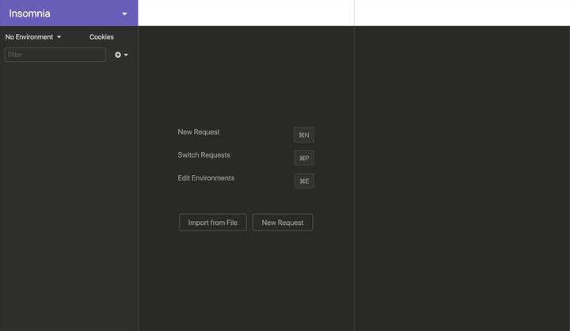
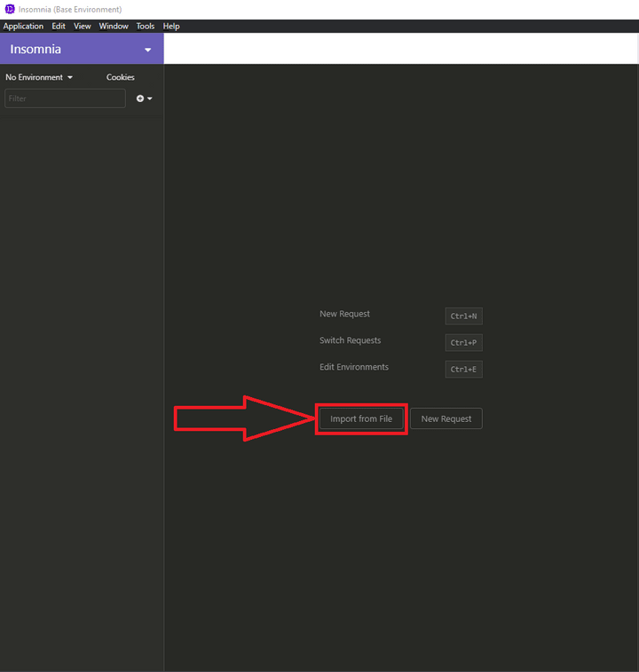
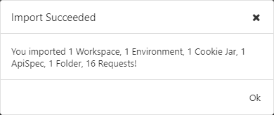
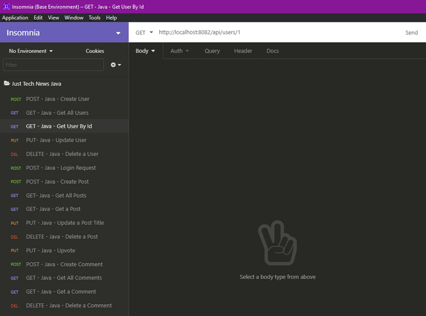
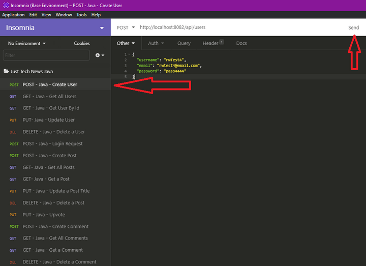
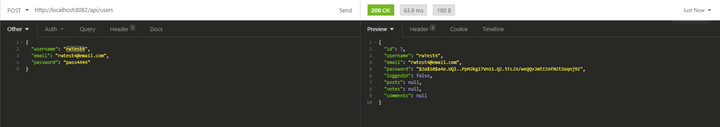

# Create Insomnia JSON/REST Test Transactions for the CRUD Controllers

Now that we've coded all this functionality, how do we test it? We can't test POST routes the same way that we can test GET routes using a browser, but we can use an application called Insomnia instead.

You've used Insomnia before, so you should already have it downloaded. Open the application, and you should see a screen that resembles the following image:



`The Insomnia window displays three blank columns for managing requests, making requests, and viewing response data.`

Insomnia allows users to import a JSON file of preconstructed test transactions, to help keep testing between teammates, departments, and other groups consistent across machines. After you finish writing a suite of tests in Insomnia, you can export the file and use it as needed.

We'll use such a file, then import it into the Insomnia application. First, though, let's review the basic structure of the JSON for an Insomnia test file.

To begin, you need to create the JSON file. Navigate to IntelliJ and right-click at the root of your project in the left-hand file navigation menu. Select New, then File, and enter the name `insomnia.json`. Paste the following code inside this file:

```json
{
  "_type": "export",
  "__export_format": 4,
  "__export_date": "2020-11-30T18:04:19.138Z",
  "__export_source": "insomnia.desktop.app:v2020.4.2",
  "resources": [
    {
      "_id": "req_a448c3f558b54948b329812d24645bca",
      "parentId": "fld_9a0c7dd086f045b69c6442e234990f72",
      "modified": 1606759408368,
      "created": 1606759408368,
      "url": "http://localhost:8082/api/users",
      "name": "POST - Java - Create User",
      "description": "",
      "method": "POST",
      "body": {
        "mimeType": "",
        "text": "{\n  \"username\": \"rwTest4\",\n  \"email\": \"rwtest4@email.com\",\n  \"password\": \"pass4444\"\n}"
      },
      "parameters": [],
      "headers": [
        {
          "name": "Content-Type",
          "value": "application/json"
        }
      ],
      "authentication": {},
      "metaSortKey": -1606758078085,
      "isPrivate": false,
      "settingStoreCookies": true,
      "settingSendCookies": true,
      "settingDisableRenderRequestBody": false,
      "settingEncodeUrl": true,
      "settingRebuildPath": true,
      "settingFollowRedirects": "global",
      "_type": "request"
    },
    {
      "_id": "fld_9a0c7dd086f045b69c6442e234990f72",
      "parentId": "wrk_d9d2a1f4cc00402185a673e2c1484f23",
      "modified": 1606759408377,
      "created": 1606759408303,
      "name": "Just Tech News Java",
      "description": "",
      "environment": {},
      "environmentPropertyOrder": null,
      "metaSortKey": -1000000000,
      "_type": "request_group"
    },
    {
      "_id": "wrk_d9d2a1f4cc00402185a673e2c1484f23",
      "parentId": null,
      "modified": 1576868547125,
      "created": 1576868547125,
      "name": "Insomnia",
      "description": "",
      "scope": null,
      "_type": "workspace"
    },
    {
      "_id": "req_3e481792fbdf4cb594797b53bded6263",
      "parentId": "fld_9a0c7dd086f045b69c6442e234990f72",
      "modified": 1606759408364,
      "created": 1606759408364,
      "url": "http://localhost:8082/api/users",
      "name": "GET - Java - Get All Users",
      "description": "",
      "method": "GET",
      "body": {},
      "parameters": [],
      "headers": [],
      "authentication": {},
      "metaSortKey": -1606758078081,
      "isPrivate": false,
      "settingStoreCookies": true,
      "settingSendCookies": true,
      "settingDisableRenderRequestBody": false,
      "settingEncodeUrl": true,
      "settingRebuildPath": true,
      "settingFollowRedirects": "global",
      "_type": "request"
    },
    {
      "_id": "req_f0ed80e3bd90463199bc64175fa6d237",
      "parentId": "fld_9a0c7dd086f045b69c6442e234990f72",
      "modified": 1606759408360,
      "created": 1606759408360,
      "url": "http://localhost:8082/api/users/1",
      "name": "GET - Java - Get User By Id",
      "description": "",
      "method": "GET",
      "body": {},
      "parameters": [],
      "headers": [],
      "authentication": {},
      "metaSortKey": -1606758078078,
      "isPrivate": false,
      "settingStoreCookies": true,
      "settingSendCookies": true,
      "settingDisableRenderRequestBody": false,
      "settingEncodeUrl": true,
      "settingRebuildPath": true,
      "settingFollowRedirects": "global",
      "_type": "request"
    },
    {
      "_id": "req_67fb401aa905461a916b41185a115eda",
      "parentId": "fld_9a0c7dd086f045b69c6442e234990f72",
      "modified": 1606759408357,
      "created": 1606759408357,
      "url": "http://localhost:8082/api/users/1",
      "name": "PUT- Java - Update User",
      "description": "",
      "method": "PUT",
      "body": {
        "mimeType": "",
        "text": "{\n    \"username\": \"Rich Widtmann\",\n    \"email\": \"rwidtmann@email.com\",\n    \"password\": \"pass9999\",\n    \"posts\": []\n}"
      },
      "parameters": [],
      "headers": [
        {
          "name": "Content-Type",
          "value": "application/json"
        }
      ],
      "authentication": {},
      "metaSortKey": -1606758078075,
      "isPrivate": false,
      "settingStoreCookies": true,
      "settingSendCookies": true,
      "settingDisableRenderRequestBody": false,
      "settingEncodeUrl": true,
      "settingRebuildPath": true,
      "settingFollowRedirects": "global",
      "_type": "request"
    },
    {
      "_id": "req_722e37a385ce40f2b923a07a87c13596",
      "parentId": "fld_9a0c7dd086f045b69c6442e234990f72",
      "modified": 1606759408353,
      "created": 1606759408353,
      "url": "http://localhost:8082/api/users/238",
      "name": "DELETE - Java - Delete a User",
      "description": "",
      "method": "DELETE",
      "body": {},
      "parameters": [],
      "headers": [],
      "authentication": {},
      "metaSortKey": -1606758078072,
      "isPrivate": false,
      "settingStoreCookies": true,
      "settingSendCookies": true,
      "settingDisableRenderRequestBody": false,
      "settingEncodeUrl": true,
      "settingRebuildPath": true,
      "settingFollowRedirects": "global",
      "_type": "request"
    },
    {
      "_id": "req_5ad450a8118e43fcaca70fcd6d655137",
      "parentId": "fld_9a0c7dd086f045b69c6442e234990f72",
      "modified": 1606759408348,
      "created": 1606759408348,
      "url": "http://localhost:8082/api/users/login",
      "name": "POST - Java - Login Request",
      "description": "",
      "method": "POST",
      "body": {
        "mimeType": "",
        "text": "{\n  \"email\": \"msmith@email.com\",\n  \"password\": \"pass2222\"\n}"
      },
      "parameters": [],
      "headers": [
        {
          "name": "Content-Type",
          "value": "application/json"
        }
      ],
      "authentication": {},
      "metaSortKey": -1606758078069,
      "isPrivate": false,
      "settingStoreCookies": true,
      "settingSendCookies": true,
      "settingDisableRenderRequestBody": false,
      "settingEncodeUrl": true,
      "settingRebuildPath": true,
      "settingFollowRedirects": "global",
      "_type": "request"
    },
    {
      "_id": "req_cbb951f1fdd74954acce79a162075d2c",
      "parentId": "fld_9a0c7dd086f045b69c6442e234990f72",
      "modified": 1606759408344,
      "created": 1606759408344,
      "url": "http://localhost:8082/api/posts",
      "name": "POST - Java - Create Post",
      "description": "",
      "method": "POST",
      "body": {
        "mimeType": "",
        "text": "{\n  \"title\": \"MSNBC Post 1\",\n  \"postUrl\": \"https://msnbc.com\",\n  \"userId\": 1\n}"
      },
      "parameters": [],
      "headers": [
        {
          "name": "Content-Type",
          "value": "application/json"
        }
      ],
      "authentication": {},
      "metaSortKey": -1606758078065,
      "isPrivate": false,
      "settingStoreCookies": true,
      "settingSendCookies": true,
      "settingDisableRenderRequestBody": false,
      "settingEncodeUrl": true,
      "settingRebuildPath": true,
      "settingFollowRedirects": "global",
      "_type": "request"
    },
    {
      "_id": "req_bb15059b53b74e37b2660cf8da294660",
      "parentId": "fld_9a0c7dd086f045b69c6442e234990f72",
      "modified": 1606759408339,
      "created": 1606759408339,
      "url": "http://localhost:8082/api/posts",
      "name": "GET- Java - Get All Posts",
      "description": "",
      "method": "GET",
      "body": {},
      "parameters": [],
      "headers": [],
      "authentication": {},
      "metaSortKey": -1606758078062,
      "isPrivate": false,
      "settingStoreCookies": true,
      "settingSendCookies": true,
      "settingDisableRenderRequestBody": false,
      "settingEncodeUrl": true,
      "settingRebuildPath": true,
      "settingFollowRedirects": "global",
      "_type": "request"
    },
    {
      "_id": "req_04d6225b6aec4eacacfa49fa34a4e8f1",
      "parentId": "fld_9a0c7dd086f045b69c6442e234990f72",
      "modified": 1606759408336,
      "created": 1606759408336,
      "url": "http://localhost:8082/api/posts/84",
      "name": "GET- Java - Get a Post",
      "description": "",
      "method": "GET",
      "body": {},
      "parameters": [],
      "headers": [],
      "authentication": {},
      "metaSortKey": -1606758078059,
      "isPrivate": false,
      "settingStoreCookies": true,
      "settingSendCookies": true,
      "settingDisableRenderRequestBody": false,
      "settingEncodeUrl": true,
      "settingRebuildPath": true,
      "settingFollowRedirects": "global",
      "_type": "request"
    },
    {
      "_id": "req_3304fd84d53f4fbd8ff1a7a969ef3fb5",
      "parentId": "fld_9a0c7dd086f045b69c6442e234990f72",
      "modified": 1606759408332,
      "created": 1606759408332,
      "url": "http://localhost:8082/api/posts/84",
      "name": "PUT - Java - Update a Post Title",
      "description": "",
      "method": "PUT",
      "body": {
        "mimeType": "",
        "text": "{\n  \"title\": \"Post 1 - edited 9\"\n}"
      },
      "parameters": [],
      "headers": [
        {
          "name": "Content-Type",
          "value": "application/json"
        }
      ],
      "authentication": {},
      "metaSortKey": -1606758078056,
      "isPrivate": false,
      "settingStoreCookies": true,
      "settingSendCookies": true,
      "settingDisableRenderRequestBody": false,
      "settingEncodeUrl": true,
      "settingRebuildPath": true,
      "settingFollowRedirects": "global",
      "_type": "request"
    },
    {
      "_id": "req_bececb0e5850413bae847dc0e7d7f8c5",
      "parentId": "fld_9a0c7dd086f045b69c6442e234990f72",
      "modified": 1606759408324,
      "created": 1606759408324,
      "url": "http://localhost:8082/api/posts/85",
      "name": "DELETE - Java - Delete a Post",
      "description": "",
      "method": "DELETE",
      "body": {},
      "parameters": [],
      "headers": [],
      "authentication": {},
      "metaSortKey": -1606758078053,
      "isPrivate": false,
      "settingStoreCookies": true,
      "settingSendCookies": true,
      "settingDisableRenderRequestBody": false,
      "settingEncodeUrl": true,
      "settingRebuildPath": true,
      "settingFollowRedirects": "global",
      "_type": "request"
    },
    {
      "_id": "req_f2482bcfb6d04d179c3a0006ec1388de",
      "parentId": "fld_9a0c7dd086f045b69c6442e234990f72",
      "modified": 1606759408320,
      "created": 1606759408320,
      "url": "http://localhost:8082/api/posts/upvote",
      "name": "PUT - Java - Upvote",
      "description": "",
      "method": "PUT",
      "body": {
        "mimeType": "",
        "text": "{\n  \"userId\": 2,\n  \"postId\": 5\n}"
      },
      "parameters": [],
      "headers": [
        {
          "name": "Content-Type",
          "value": "application/json"
        }
      ],
      "authentication": {},
      "metaSortKey": -1606758078049,
      "isPrivate": false,
      "settingStoreCookies": true,
      "settingSendCookies": true,
      "settingDisableRenderRequestBody": false,
      "settingEncodeUrl": true,
      "settingRebuildPath": true,
      "settingFollowRedirects": "global",
      "_type": "request"
    },
    {
      "_id": "req_08fe8ecf9d7a4c089c102f1bfaa85c77",
      "parentId": "fld_9a0c7dd086f045b69c6442e234990f72",
      "modified": 1606759408317,
      "created": 1606759408317,
      "url": "http://localhost:8082/api/comments",
      "name": "POST - Java - Create Comment",
      "description": "",
      "method": "POST",
      "body": {
        "mimeType": "",
        "text": "{\n    \"commentText\": \"Comment 87\",\n    \"userId\": 1,\n    \"postId\": 221\n}"
      },
      "parameters": [],
      "headers": [
        {
          "name": "Content-Type",
          "value": "application/json"
        }
      ],
      "authentication": {},
      "metaSortKey": -1606758078046,
      "isPrivate": false,
      "settingStoreCookies": true,
      "settingSendCookies": true,
      "settingDisableRenderRequestBody": false,
      "settingEncodeUrl": true,
      "settingRebuildPath": true,
      "settingFollowRedirects": "global",
      "_type": "request"
    },
    {
      "_id": "req_2c77e3e9e4134c93b5ac480c51b45c65",
      "parentId": "fld_9a0c7dd086f045b69c6442e234990f72",
      "modified": 1606759408313,
      "created": 1606759408313,
      "url": "http://localhost:8082/api/comments",
      "name": "GET - Java - Get All Comments",
      "description": "",
      "method": "GET",
      "body": {},
      "parameters": [],
      "headers": [],
      "authentication": {},
      "metaSortKey": -1606758078044,
      "isPrivate": false,
      "settingStoreCookies": true,
      "settingSendCookies": true,
      "settingDisableRenderRequestBody": false,
      "settingEncodeUrl": true,
      "settingRebuildPath": true,
      "settingFollowRedirects": "global",
      "_type": "request"
    },
    {
      "_id": "req_ebfaebf49924402dabf30acb85eeb1c6",
      "parentId": "fld_9a0c7dd086f045b69c6442e234990f72",
      "modified": 1606759408310,
      "created": 1606759408310,
      "url": "http://localhost:8082/api/comments/33",
      "name": "GET - Java - Get a Comment",
      "description": "",
      "method": "GET",
      "body": {},
      "parameters": [],
      "headers": [],
      "authentication": {},
      "metaSortKey": -1606758078041,
      "isPrivate": false,
      "settingStoreCookies": true,
      "settingSendCookies": true,
      "settingDisableRenderRequestBody": false,
      "settingEncodeUrl": true,
      "settingRebuildPath": true,
      "settingFollowRedirects": "global",
      "_type": "request"
    },
    {
      "_id": "req_463b36b65e284451ba4dde05a7259851",
      "parentId": "fld_9a0c7dd086f045b69c6442e234990f72",
      "modified": 1606759408306,
      "created": 1606759408306,
      "url": "http://localhost:8082/api/comments/239",
      "name": "DELETE - Java - Delete a Comment",
      "description": "",
      "method": "DELETE",
      "body": {},
      "parameters": [],
      "headers": [],
      "authentication": {},
      "metaSortKey": -1606758078038,
      "isPrivate": false,
      "settingStoreCookies": true,
      "settingSendCookies": true,
      "settingDisableRenderRequestBody": false,
      "settingEncodeUrl": true,
      "settingRebuildPath": true,
      "settingFollowRedirects": "global",
      "_type": "request"
    },
    {
      "_id": "env_ce1fe27f0017edab2273f88a46a21383d0ed092d",
      "parentId": "wrk_d9d2a1f4cc00402185a673e2c1484f23",
      "modified": 1576868547149,
      "created": 1576868547149,
      "name": "Base Environment",
      "data": {},
      "dataPropertyOrder": null,
      "color": null,
      "isPrivate": false,
      "metaSortKey": 1576868547149,
      "_type": "environment"
    },
    {
      "_id": "jar_ce1fe27f0017edab2273f88a46a21383d0ed092d",
      "parentId": "wrk_d9d2a1f4cc00402185a673e2c1484f23",
      "modified": 1576868547154,
      "created": 1576868547154,
      "name": "Default Jar",
      "cookies": [],
      "_type": "cookie_jar"
    },
    {
      "_id": "spc_a997d4d15ded4c499c0e8e2f65ab8248",
      "parentId": "wrk_d9d2a1f4cc00402185a673e2c1484f23",
      "modified": 1606327643563,
      "created": 1606327643563,
      "fileName": "Insomnia",
      "contents": "",
      "contentType": "yaml",
      "_type": "api_spec"
    }
  ]
}
```

Now open your Insomnia app. Click the "Import from File" button on the main screen (as shown in the following image), and choose the `insomnia.json` file (where you just pasted the preceding code):



`In Insomnia, a red arrow points at the "Import from File" button near the middle of the screen.`

If prompted "How would you like to import "Insomnia"?", select "Request Collection". Once you import the file, you should be prompted with a success message, as shown in the following image:



`A modal with a white background indicates "Import Succeeded" and summarizes the contents of the import.`

Click "Ok", and you'll be brought back to the main screen of Insomnia. On the left side, you should see the heading Just Tech News Java, plus all of the different routes we'll test. It should look something like the following image:



`On the left side of the Insomnia window, the Get User By ID POST route is highlighted.`

Great! However, we need to run the API again before we actually use these tests. Navigate to IntelliJ and run your API. Once that's done, navigate back to Insomnia.

First you'll test the POST route for creating users. On the left-side navigation of Insomnia, click the `POST - Java - Create User` route. You can update the body of the request to any username, email address, and password you want. Once you've selected that first POST route, press Send. See the following image for reference:



`On the left side of the Insomnia window, the Create User POST route is highlighted. The request appares on the right side of the screen, with a red arrow pointing at Send in the top right.`

Once you've pressed Send, the right side of the screen will process the request (very quickly), and you should see the successful creation of your user, as shown in the following image:



`Insomnia indicates the successful creation of the user.`

Keep in mind that some of the routes provided will require minor changes to function properly. Changing the `id` parameters will normally resolve that issue and allow the route tests to function.

---
© 2022 edX Boot Camps LLC. Confidential and Proprietary. All Rights Reserved.