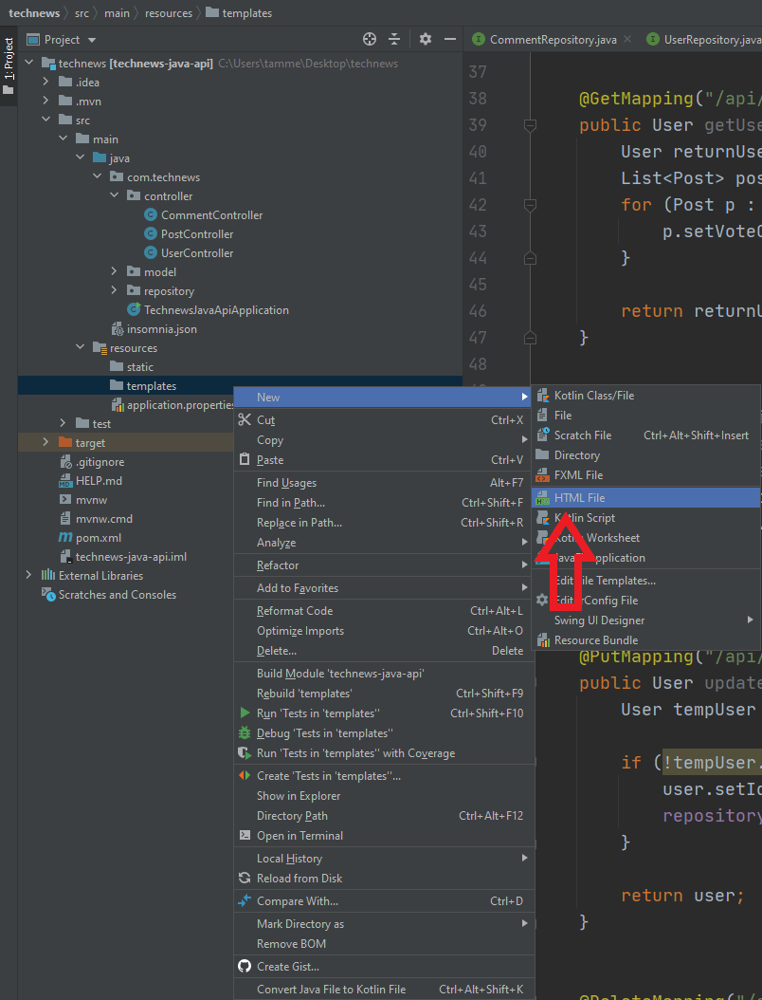

# Create the Main Layout Template

We'll start by making the main template layout, `main.html`.

As we've discussed before, Spring offers lots of useful functionality, but we have to follow a few rules to take full advantage of that functionality. For one thing, we need to place certain files in specific folders so that Spring can locate them. The templates we make will need to be placed in a folder that Spring Initializr created for us when we generated the project—named `templates` and found in `main/resources/templates`.

**Note**

> This `resources` file is at the same file-structure level as `java`, and not inside it. The `resources` folder is where we'll put things like templates, CSS, and JS files.

Navigate to IntelliJ. On the left-hand file navigation menu, right-click the `resources/templates` folder. Choose New, then select HTML File, and name the file `layout.html`, choosing the option for "HTML 5 file". See the following image for reference:



`In IntelliJ, the user has right-clicked "templates," then selected "New" and "HTML file" from the menus.`

Now that you've created the file, copy and paste the following HTML into the newly created `layout.html`:

```html
<!DOCTYPE html>
<html lang="en" xmlns:th="http://www.thymeleaf.org" xmlns:layout="http://www.ultraq.net.nz/thymeleaf/layout">
<head>
    <meta charset="UTF-8">
    <meta name="viewport" content="width=device-width, initial-scale=1, shrink-to-fit=no">
    <title layout:title-pattern="$CONTENT_TITLE - $LAYOUT_TITLE">Just Tech News</title>
    <link rel="stylesheet" href="/css/style.css">
</head>
<body>
<div class="wrapper">
    <header>
        <h1>
            <a href="/">Just Tech News</a>
        </h1>
        <nav>
            <div th:if="${loggedIn}">
                <a th:href="@{/dashboard}">dashboard</a>
                <a th:href="@{/users/logout}">logout</a>
            </div>
            <div th:unless="${loggedIn}">
                <a th:href="@{/login}">login</a>
            </div>
        </nav>
    </header>

    <main layout:fragment="content">
        <p>This is filled by the content template.</p>
    </main>

    <footer>
        Thanks for visiting!
    </footer>
</div>

</body>
</html>
```

Let's break down all the separate pieces of this code block:

* The first thing you might notice is the line at the top of the file, specifying the Thymeleaf namespace definitions and allowing you to use Thymeleaf syntax in the document.

* The `layout:title-pattern` attribute within the `<head>` will make the title dynamic. Because we're using a layout template, we want to ensure that the title changes with the templates that we bring in. When we show a different view template, the title will change to reflect the pattern of `$CONTENT_TITLE - $LAYOUT_TITLE"`. So when we load a template in, we'll see a new title on the tab of the HTML in the browser!

* Next, in the `<nav>` element, `th:if=` is a conditional statement from Thymeleaf. The `if` statement will render HTML elements based on a provided condition; in the first `div`, that condition is that the user is logged in.

* Skipping down a few lines, you'll see `th:unless`, the next part of the `if` statement. If the condition isn't met and it returns false, the user will be directed to the login page, where they can satisfy the condition. This functions exactly like the `{{#if author}}` syntax from Handlebars.js.

* The `th:href` syntax will dynamically change the `<a>` element's `href` values based on the evaluation of the `if` conditionals. If a user is logged in, they'll see the dashboard and logout links in their nav. If they're not logged in, they'll only have the login link available.

* Finally, the Thymeleaf attribute `layout:fragment="content"`—the most important piece—will allow other templates to be displayed in this section of the page. This functions much like `{{{ body }}}` in Handlebars.js, which would designate where we'd inject the partials.

Now that we've created the main layout template, let's build the homepage template, which we'll inject into the `layout.html` content area.

But first, push all of your work to GitHub, using the following Git workflow:

```console
git add .
git commit -m "message"
git push origin main
```

---
© 2022 edX Boot Camps LLC. Confidential and Proprietary. All Rights Reserved.