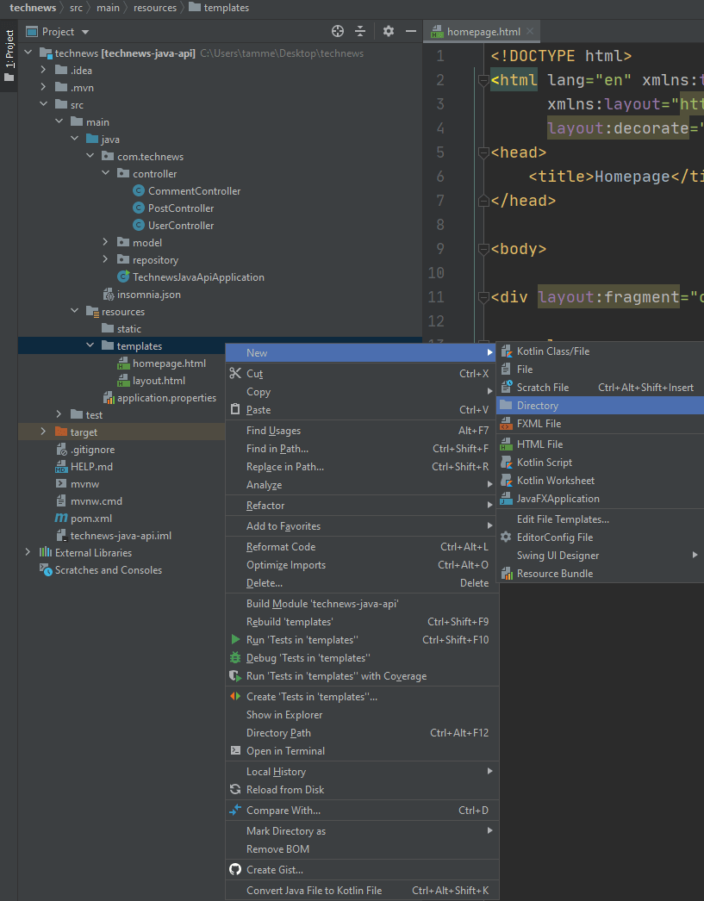

# Create the Post and Comment Template Fragments

As we've mentioned, a fragment in Thymeleaf is a small piece of code that can be included in as many templates as needed. Fragments can simplify repetitive functionality and help us separate concerns for easier debugging, as we reduce or eliminate duplicate code across multiple files.

In IntelliJ, create a new folder inside the `templates` folder. You can do this by right-clicking "templates", then selecting "New" and choosing "Directory". Name this folder `fragments`. You can see the following image for reference:



`In IntelliJ, the user has right-clicked "templates," then selected "New" and "Directory" from the menus.`

Great! Inside that `fragments` folder, create a new HTML file named `post-fragment.html`. Copy and paste the following code into your newly created `post-fragment.html` file:

```html
<!DOCTYPE html>
<html lang="en" xmlns:th="http://www.thymeleaf.org" xmlns:layout="http://www.ultraq.net.nz/thymeleaf/layout">
<head>
    <meta charset="UTF-8">
    <meta name="viewport" content="width=device-width, initial-scale=1, shrink-to-fit=no">
    <title layout:title-pattern="$CONTENT_TITLE - $LAYOUT_TITLE">Just Tech News</title>
    <link rel="stylesheet" href="/css/style.css">
</head>
<body>

<article class="post" th:fragment="post-fragment">
  <div class="title">
    <a th:href="@{ ${post.postUrl} }" target="_blank">[[${post.title}]]</a>

    <div th:if="${#strings.contains(post.postUrl, 'http://')}">
      <div th:with="arg=${#strings.replace(post.postUrl,'http://','')}">
        <div th:if="${#strings.contains(arg, '/')}">
          <div th:with="arg2=${#strings.arraySplit(arg, '/')}">
            <span th:text="${#strings.toString(arg2[0])}"></span>
          </div>
        </div>
        <div th:unless="${#strings.contains(arg, '/')}">
          <div th:if="${#strings.contains(arg, '?')}">
            <div th:with="arg2=${#strings.arraySplit(arg, '?')}">
              <span th:text="${#strings.toString(arg2[0])}"></span>
            </div>
          </div>
          <div th:unless="${#strings.contains(arg, '?')}">
            <span th:text="${#strings.toString(arg)}"></span>
          </div>
        </div>
      </div>
    </div>

    <div th:if="${#strings.contains(post.postUrl, 'https://')}">
      <div th:with="arg=${#strings.replace(post.postUrl,'https://','')}">
        <div th:if="${#strings.contains(arg, '/')}">
          <div th:with="arg2=${#strings.arraySplit(arg, '/')}">
            <span th:text="${#strings.toString(arg2[0])}"></span>
          </div>
        </div>
        <div th:unless="${#strings.contains(arg, '/')}">
          <div th:if="${#strings.contains(arg, '?')}">
            <div th:with="arg2=${#strings.arraySplit(arg, '?')}">
              <span th:text="${#strings.toString(arg2[0])}"></span>
            </div>
          </div>
          <div th:unless="${#strings.contains(arg, '?')}">
              <span th:text="${#strings.toString(arg)}"></span>
          </div>
        </div>
      </div>
    </div>

    <div th:if="${#strings.contains(post.postUrl, 'www.')}">
      <div th:with="arg=${#strings.replace(post.postUrl,'www.','')}">
        <div th:if="${#strings.contains(arg, '/')}">
          <div th:with="arg2=${#strings.arraySplit(arg, '/')}">
            <span th:text="${#strings.toString(arg2[0])}"></span>
          </div>
        </div>
        <div th:unless="${#strings.contains(arg, '/')}">
          <div th:if="${#strings.contains(arg, '?')}">
            <div th:with="arg2=${#strings.arraySplit(arg, '?')}">
              <span th:text="${#strings.toString(arg2[0])}"></span>
            </div>
          </div>
          <div th:unless="${#strings.contains(arg, '?')}">
            <span th:text="${#strings.toString(arg)}"></span>
          </div>
        </div>
      </div>
    </div>

    <div th:if="${post.voteCount == 1}" class="meta">
      [[${post.voteCount}]] point by [[${post.userName}]] on
      <span th:text="${#dates.format(post.postedAt, 'MM-dd-YY')}"></span>

      <a th:href="@{/post/{id}(id=${post.id})}" th:if="${post.comments.size() == 1}">[[${post.comments.size()}]]
        comment</a>
      <a th:href="@{/post/{id}(id=${post.id})}" th:unless="${post.comments.size() == 1}">[[${post.comments.size()}]]
        comments</a>
    </div>
    <div th:unless="${post.voteCount == 1}" class="meta">
      [[${post.voteCount}]] points by [[${post.userName}]] on
      <span th:text="${#dates.format(post.postedAt, 'MM-dd-YY')}"></span>
      |
      <a th:href="@{/post/{id}(id=${post.id})}" th:if="${post.comments.size() == 1}">[[${post.comments.size()}]]
          comment</a>
      <a th:href="@{/post/{id}(id=${post.id})}" th:unless="${post.comments.size() == 1}">[[${post.comments.size()}]]
          comments</a>
    </div>
  </div>
</article>

</body>
```

Now we'll break down this code block and discuss it in detail:

* Within `<article>`, we find code representing a `post` object from the database. Text outside an element in Thymeleaf can be displayed using the syntax `[[${post.title}]]`, with the full line of code as follows:

```html
<a th:href="@{ ${post.postUrl} }" target="_blank">[[${post.title}]]</a>
```

* You'll also find a conditional written in Thymeleaf syntax, with one `<div>` that contains `th:if` and another that contains `th:unless`. This is basically saying, if a condition is true, display this `<div>`; otherwise (unless), display the other `<div>`.

* In `post-fragment.html`, the Thymeleaf helper elements work to maintain consistent formatting, starting with the **date format helper**. As the name suggests, this `dates.format()` function helps us to format dates. The arguments specify the `object.property` and the format that we want to put it in. This makes the formatting consistent across all `<span>` elements using this Thymeleaf attribute.

* Next comes the **URL format helper**. The `strings.replace()` function allows us to replace `http://` in the `postUrl` with an empty space, to tidy up the URLs listed on the page.

* Finally, let's look at the **plural words helper**. We use the Thymeleaf `th:if` and `th:unless` construct to help determine whether to use the word "comment" or "comments".

These Thymeleaf helper functions can be useful for formatting data in a reliable and repeatable way. They might look daunting, but they're actually quite simple once you've written a few. Take some time to review the preceding code and dissect it for yourself, leaning on the extensive knowledge that you've already acquired.

Now that we've taken care of `post-fragment.html`, let's create a `comment-fragment.html` file as well, adding the following code inside:

```html
<!DOCTYPE html>
<html lang="en" xmlns:th="http://www.thymeleaf.org" xmlns:layout="http://www.ultraq.net.nz/thymeleaf/layout">
<head>
    <meta charset="UTF-8">
    <meta name="viewport" content="width=device-width, initial-scale=1, shrink-to-fit=no">
    <title layout:title-pattern="$CONTENT_TITLE - $LAYOUT_TITLE">Just Tech News</title>
    <link rel="stylesheet" href="/css/style.css">
</head>
<body>

<section th:each="comment : ${commentList}" class="comment" th:fragment="comment-fragment">
    <div class="meta">
        [[${post.userName}]] on
        <span th:text="${#dates.format(post.postedAt, 'MM-dd-YY')}"></span>
    </div>
    <div class="text">
        [[${comment.commentText}]]
    </div>
</section>

</body>
```

This code largely accomplishes the same goal as our `post-fragment.html` file, except it displays information about comments instead of posts. You can see it's much simpler, since there's less data to account for—just the username of the comment's poster, the time the comment was posted, and the comment's text—and we use the same syntax as with our other fragment file.

Let's move on to creating the `login.html` template—as soon as we push all of this work to GitHub, using the following Git workflow:

```console
git add .
git commit -m "message"
git push origin main
```

---
© 2022 edX Boot Camps LLC. Confidential and Proprietary. All Rights Reserved.