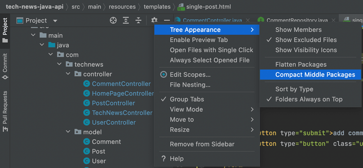

# Create the Upvote File

As mentioned previously, we do need to use JavaScript in some parts of the API to capture data from the user, after which we'll make a call and pass that data to one of the API endpoints. The `single-post.html` page is one such situation, allowing users to click a button to upvote a post. These upvotes are tallied and saved in a `vote_count` column of the `Post` table in the MySQL database. When users click the upvote button, the `upvote.js` file will facilitate the processing necessary to increment the `vote_count` in the database.

Let's create this file!

To ensure that Spring can find them, JavaScript and CSS files need to be placed first in `/resources/static`, then in their own `js` or `css` folders. But first, at the top of the left-hand file navigation menu in IntelliJ, click the Settings icon (shaped like a gear) and confirm that the "Compact Middle Packages" option (within the "Tree Appearance" sub-menu) is NOT checked. See the following image for reference:



`In IntelliJ, a red arrow points out the Settings icon, and on the drop-down menu, "Compact Middle Packages" is unchecked.`

Now, on the left-hand file navigation menu, right-click on the `static` folder, and create a new directory called `css`. After that, create a new file called `style.css`, and paste the following CSS into the newly created file:

```css
* {
  box-sizing: border-box;
}

body, html {
  height: 100%;
  padding: 0;
  margin: 0;
  font-family: sans-serif;
  color: #333;
}

a {
  text-decoration: none;
  color: #225ca3;
  font-weight: bold;
  transition: color .1s;
}

a:hover {
  color: #3486eb;
}

button {
  background-color: #225ca3;
  border: 0;
  padding: 1%;
  color: white;
  font-weight: bold;
  transition: background-color .1s;
  cursor: pointer;
  border-radius: 5px;
}

button:hover {
  background-color: #3486eb;
}

.post-list {
  margin: 0;
  padding: 0;
}

textarea, input {
  padding: .5%;
  border-radius: 5px;
  border: 1px solid #ccc;
}

textarea:focus, input:focus {
  outline: none;
  border: 1px solid #3486eb;
}

textarea {
  min-width: 40%;
  min-height: 100px;
}

form > div {
  margin-bottom: 2%;
}

form label {
  display: block;
}

.wrapper {
  width: 100%;
  min-height: 100%;
  max-width: 1200px;
  margin: 0 auto;
  display: flex;
  flex-direction: column;
}

header {
  border-bottom: 1px solid #ccc;
  display: flex;
  justify-content: space-between;
  align-items: center;
  padding: 0 1%;
}

header h1 {
  font-size: 1em;
}

main {
  flex: 1;
  padding: 2% 4%;
}

.btn-no-style {
  background: none;
  border: none;
  padding: 0;
  cursor: pointer;
  text-decoration: none;
  color: #225ca3;
  font-size: 100%;
  font-weight: bold;
  transition: color .1s;
  margin-left: 16px;
}

.btn-no-style:hover {
  background: none;
  color: #3486eb;
}

.delete-post-btn {
  background-color: #d41414;
}

.delete-post-btn:hover {
  background-color: #ff643d;
}

.post {
  margin-bottom: 2%;
  line-height: 150%;
}

.post .title span {
  font-style: italic;
  font-size: 90%;
  color: #7d7d7d;
}

.edit-link {
  display: block;
  margin: -1.5% 0 2% 0;
}

.upvote-btn {
  background-color: #197d0f;
  transition: background-color .1s;
}

.upvote-btn:hover {
  background-color: #1f9c13;
}

.comment-form {
  margin-bottom: 5%;
}

.comment {
  padding: 1%;
  margin-bottom: 1%;
}

.comment:nth-child(odd) {
  background-color: #fff5eb;
}

.comment .meta {
  font-size: 90%;
  margin-bottom: .5%;
  opacity: .6;
}

.new-post-form input {
  width: 300px;
}

.edit-post-form {
  margin-bottom: 5%;
}

.flash-message {
  background-color: #ffb6c1;
  color: red;
  text-align: center;
}

footer {
  border-top: 1px solid #ccc;
  display: flex;
  justify-content: center;
  padding: 1%;
  font-size: 110%;
}
```

**Note**

> Feel free to study this CSS on your own.

Next, we'll create the first JavaScript file to help with some functionality. Create a new directory called `js`, then create a new file inside `js` called `upvote.js`. Copy and paste the following code into the newly created `upvote.js` file:

```js
async function upvoteClickHandler(event) {
  event.preventDefault();

  const id = window.location.toString().split('/')[
    window.location.toString().split('/').length - 1
  ];


  const response = await fetch('/posts/upvote', {
    method: 'PUT',
    body: JSON.stringify({
        postId: id
    }),
    headers: {
      'Content-Type': 'application/json'
    }
  });

  if (response.ok) {
    document.location.reload();
  } else {
    alert(response.statusText);
  }
}

document.querySelector('.upvote-btn').addEventListener('click', upvoteClickHandler);
```

This should all look very familiar, but let's review a few of the key points.

First, we declare the `upvoteClickHandler()` as an async JavaScript function. Next, we parse out the `id` via the `window.location()` method. By awaiting the response (`response = await`), we can capture the `id` value of the post and save it to a property (postId). So when the `fetch()` method makes a call to the `/posts/upvote` route, we capture the `id` of the location and then send it as a PUT request. Finally, `document.querySelector()` attaches an event listener to the button, using class `upvote-btn`, and awaits a click.

You can create the remaining files quickly now that you're familiar with all the code! But, to deepen your understanding, be sure to review the code that you copy and paste into each file.

---
© 2022 edX Boot Camps LLC. Confidential and Proprietary. All Rights Reserved.