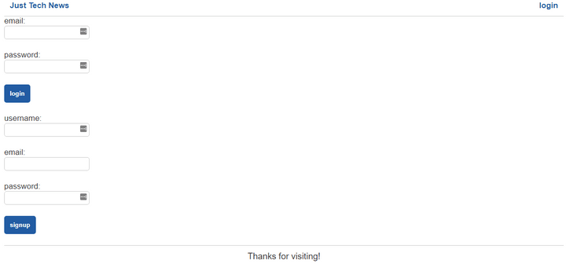
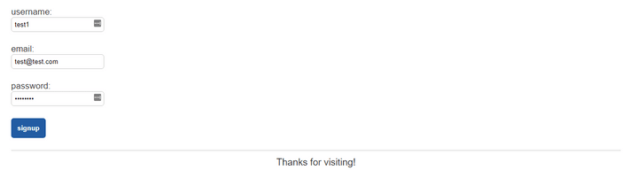
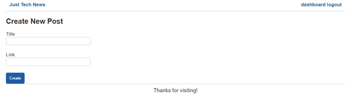
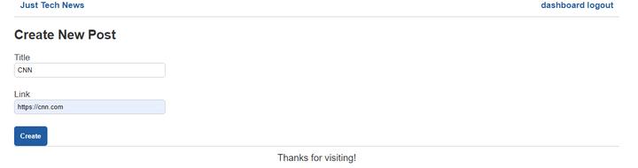
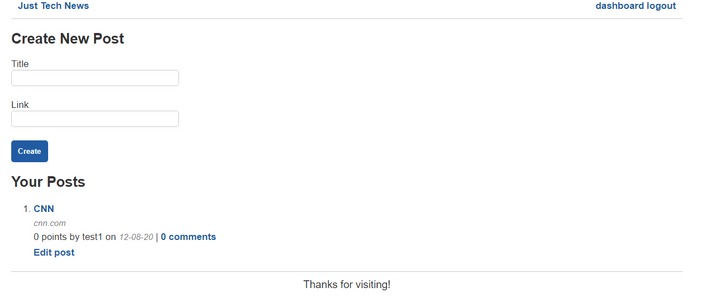

# Create the TechNewsController

This next controller serves very much as the API processing manager—it is more concerned with processing data than navigating the user. `TechNewsController` will mostly comprise `@PostMapping` endpoints focused on the back-end server-side processing that manages the database and the flow of data to and from the end user.

Create a new class in your `controller` directory and name it `TechNewsController`. Inside your newly created class, you should see the following code:

```java
package com.technews.controller;

public class TechNewsController {
    
}
```

First we need to add the class-level `@Controller` annotation, plus the `@Autowired` annotations we used inside `HomePageController`. With those additions, the class should look like the following example:

```java
package com.technews.controller;

import com.technews.repository.CommentRepository;
import com.technews.repository.PostRepository;
import com.technews.repository.UserRepository;
import com.technews.repository.VoteRepository;
import org.springframework.beans.factory.annotation.Autowired;
import org.springframework.stereotype.Controller;

@Controller
public class TechNewsController {

  @Autowired
  PostRepository postRepository;

  @Autowired
  VoteRepository voteRepository;

  @Autowired
  UserRepository userRepository;

  @Autowired
  CommentRepository commentRepository;
    
}
```

## Create the POST Endpoints

Now we can bring in the `@PostMapping` annotation methods. Let's start by adding data processing for the `/users/login` route. Copy the following code and paste it under `CommentRepository commentRepository`:

```java
@PostMapping("/users/login")
  public String login(@ModelAttribute User user, Model model, HttpServletRequest request) throws Exception {

  if ((user.getPassword().equals(null) || user.getPassword().isEmpty()) || (user.getEmail().equals(null) || user.getPassword().isEmpty())) {
    model.addAttribute("notice", "Email address and password must be populated in order to login!");
    return "login";
  }

  User sessionUser = userRepository.findUserByEmail(user.getEmail());

  try {
    // If sessionUser is invalid, running .equals() will throw an error
    if (sessionUser.equals(null)) {

    }
    // We will catch an error and notify client that email address is not recognized
  } catch (NullPointerException e) {
    model.addAttribute("notice", "Email address is not recognized!");
    return "login";
  }

  // Validate Password
  String sessionUserPassword = sessionUser.getPassword();
  boolean isPasswordValid = BCrypt.checkpw(user.getPassword(), sessionUserPassword);
  if(isPasswordValid == false) {
    model.addAttribute("notice", "Password is not valid!");
    return "login";
  }

  sessionUser.setLoggedIn(true);
  request.getSession().setAttribute("SESSION_USER", sessionUser);

  return "redirect:/dashboard";
}
```

The preceding code is the POST `login` endpoint. Let's dissect it!

The first big `if` statement checks that all fields were properly filled in. Then we populate the `sessionUser` variable by identifying the email of the user. If the user is found by their email, we'll create a new session variable, set the `loggedIn` variable to `true`, and finally return the `dashboard.html` template, allowing them to see and use that page. But if the user is NOT found by their email, we throw an exception and redirect them to the `login.html` template to try again.

**Note**

> In Java, we can't compare `Strings` with a `==` operator like in JavaScript—instead, we use the `String` method `.equals()` to determine if they are equivalent.

Great! Now the next method will be the POST `AddUser` endpoint. Copy the following code and paste it under the preceding method:

```java
@PostMapping("/users")
  public String signup(@ModelAttribute User user, Model model, HttpServletRequest request) throws Exception {

  if ((user.getUsername().equals(null) || user.getUsername().isEmpty()) || (user.getPassword().equals(null) || user.getPassword().isEmpty()) || (user.getEmail().equals(null) || user.getPassword().isEmpty())) {
    model.addAttribute("notice", "In order to signup username, email address and password must be populated!");
    return "login";
  }

  try {
    // Encrypt password
    user.setPassword(BCrypt.hashpw(user.getPassword(), BCrypt.gensalt()));
    userRepository.save(user);
  } catch (DataIntegrityViolationException e) {
    model.addAttribute("notice", "Email address is not available! Please choose a different unique email address.");
    return "login";
  }

  User sessionUser = userRepository.findUserByEmail(user.getEmail());

  try {
    if (sessionUser.equals(null)) {

    }
  } catch (NullPointerException e) {
    model.addAttribute("notice", "User is not recognized!");
    return "login";
  }

  sessionUser.setLoggedIn(true);
  request.getSession().setAttribute("SESSION_USER", sessionUser);

  return "redirect:/dashboard";
  }
```

This route allows users to create a new profile on Just Tech News. We complete the same validation as in the POST `login` endpoint, to ensure that all fields are fully populated. Next, we encrpyt the proposed user's password, via `BCrypt`, and save that new user to the database. If successful, the API will redirect users to the `login.html` page, where they can enter their new credentials. If the save fails, we'll throw an exception and redirect them to the login page to try again.

## Create the POST and PUT Endpoints

To create the POST and PUT endpoint for the dashboard, copy the following code and paste it under the previous method:

```java
@PostMapping("/posts")
  public String addPostDashboardPage(@ModelAttribute Post post, Model model, HttpServletRequest request) {

    if ((post.getTitle().equals(null) || post.getTitle().isEmpty()) || (post.getPostUrl().equals(null) || post.getPostUrl().isEmpty())) {
      return "redirect:/dashboardEmptyTitleAndLink";
    }

    if (request.getSession(false) == null) {
      return "redirect:/login";
    } else {
      User sessionUser = (User) request.getSession().getAttribute("SESSION_USER");
      post.setUserId(sessionUser.getId());
      postRepository.save(post);

      return "redirect:/dashboard";
    }
  }
```

This functionality will allow users to add a post from their dashboard. First, if the session isn't valid, we redirect them to the `login.html`. If the session is valid and they submit a post, we'll set the `userId` for that post to be the id of the `sessionUser`. Simple enough!

What if the user wants to see an updated post? We created the template and the controller for that—now we need to process. Paste the following code beneath the previous method:

```java
@PostMapping("/posts/{id}")
  public String updatePostDashboardPage(@PathVariable int id, @ModelAttribute Post post, Model model, HttpServletRequest request) {

    if (request.getSession(false) == null) {
      model.addAttribute("user", new User());
      return "redirect/dashboard";
    } else {
      Post tempPost = postRepository.getById(id);
      tempPost.setTitle(post.getTitle());
      postRepository.save(tempPost);

      return "redirect:/dashboard";
    }
  }
  ```

As always, if the session isn't valid, we redirect them to the login page! If the session is valid, we get the specific post by its id, using `getById(id)`. Next, we take the updated title data for the post and save it as the new title, via `setTitle`. Then we save the post and return the dashboard template.

The next method will allow users to comment on their own or others' posts. Copy the following code and paste it below the previous method:

```java
@PostMapping("/comments")
public String createCommentCommentsPage(@ModelAttribute Comment comment, Model model, HttpServletRequest request) {

  if (comment.getCommentText().isEmpty() || comment.getCommentText().equals(null)) {
    return "redirect:/singlePostEmptyComment/" + comment.getPostId();
  } else {
    if (request.getSession(false) != null) {
      User sessionUser = (User) request.getSession().getAttribute("SESSION_USER");
      comment.setUserId(sessionUser.getId());
      commentRepository.save(comment);
      return "redirect:/post/" + comment.getPostId();
  } else {
      return "login";
    }
  }
}
```

So let's break this down. First, if the comment text area is blank, we throw an exception to let users know that they need to fill in that text, then we return them to the same `edit-post.html` template. If the session is invalid, we return them to the login page. But if the session IS valid, we can set the `comment userId` to be equal to the current `sessionUser` id, because the current session user is the one who made the comment.

Finally, we save that comment and return the user to the `edit-post.html` background, with a new comment created.

To address editing comments, copy the following code below the previous method:

```java
@PostMapping("/comments/edit")
public String createCommentEditPage(@ModelAttribute Comment comment, HttpServletRequest request) {

  if (comment.getCommentText().equals("") || comment.getCommentText().equals(null)) {
    return "redirect:/editPostEmptyComment/" + comment.getPostId();
  } else {
    if (request.getSession(false) != null) {
      User sessionUser = (User) request.getSession().getAttribute("SESSION_USER");
      comment.setUserId(sessionUser.getId());
      commentRepository.save(comment);

      return "redirect:/dashboard/edit/" + comment.getPostId();
    } else {
      return "redirect:/login";
    }
  }

}
```

In this route, if the text area is blank, we throw an exception to alert users that they need to fill in that text, and we return them the same `edit-post.html` template. If the session is invalid, we return them to the login page (as usual). But if the session IS valid, we can set the `comment userId` to be equal to the current `sessionUser` id; then we save the newly updated comment and redirect back to the edit page.

Let's create the final method now, which will allow us to upvote posts! Paste the following code below the previous method:

```java
@PutMapping("/posts/upvote")
public void addVoteCommentsPage(@RequestBody Vote vote, HttpServletRequest request, HttpServletResponse response) {

    if (request.getSession(false) != null) {
        Post returnPost = null;
        User sessionUser = (User) request.getSession().getAttribute("SESSION_USER");
        vote.setUserId(sessionUser.getId());
        voteRepository.save(vote);

        returnPost = postRepository.getById(vote.getPostId());
        returnPost.setVoteCount(voteRepository.countVotesByPostId(vote.getPostId()));
    }
}
```

For upvotes, if the session is valid, then we need to set the `vote userId` to be equal to the `sessionUser Id`. Once that's set, we just save the vote, incrementing `setVoteCount` by 1.

That was a lot of code that we just created for a single file, so we should test it all!

## Test the TechNewsController Code

Run your Java server and open your browser to `localhost:8082/login`. You should see something like the following image:



`On the Just Tech News login page, both login and signup fields appear for the user.`

Enter some test information and click "signup", as shown in the following image:



`The user has entered generic test information in each of the fields of the signup form.`

Once the form is submitted, you should be brought to the dashboard page, as shown in the following image:



`The Just Tech News dashboard page features a form for users to "Create New Post", with fields for a title and link.`

To create a new post, enter a title and a valid URL, then click Create—as shown in the following image:



`In the form to create a new post, the user has entered "CNN" under the title field, along with https://cnn.com for the URL.`

Great! That should successfully create a post, and you should see a screen resembling the following image:



`The post titled "CNN" now appears under the heading "Your Posts" beneath the form for creating a new post.`

**Hint**

> If you see any errors with retrieving Posts from your database, check your error messages in IntelliJ to see if there are any leads to what the issue is. Are there any leftover entries with invalid data from your Insomnia testing that might be throwing these errors? Could clearing those tables help?

At this point, push your changes up to GitHub using the Git workflow, as follows:

```console
git add .
git commit -m "message"
git push origin main
```

---
© 2022 edX Boot Camps LLC. Confidential and Proprietary. All Rights Reserved.