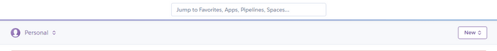
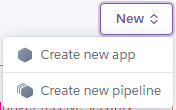
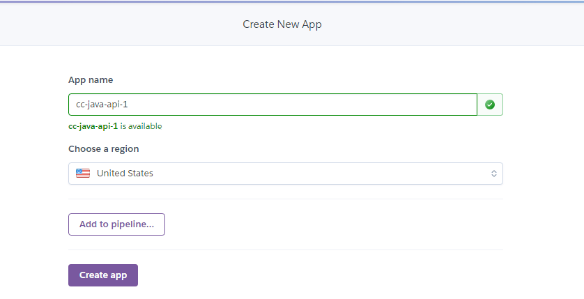

# Create the Application Dashboard on Heroku

Open your browser, navigate to the [Heroku website](https://heroku.com/), and log in to your account. Once you're logged in, you should see your Heroku dashboard, displaying any deployed applications of yours and their links and statuses.

From here, we'll create a new project. Towards the top right of the screen, click the "New" button, as shown in the following image:

`The Heroku dashboard displays a button labeled "New" in the top right.`

Select "Create new app" from the dropdown, as shown in the following image:

`The user has clicked the "New" button, revealing a dropdown with "Create new app" as the first option.`

You'll be brought to the Create New App screen. Enter your app name. You can use any name, but try `cc-java-api` to start. You'll get an error saying that the name is already taken, so add a hyphen and a number (for example, `cc-java-api-1`) until the name is available. Once you find an available name, press the "Create app" button, as shown in the following image:

`On the Create New App page of Heroku, a form displays fields for an app name and region, with a purple "Create app" button at the bottom.`

Now you should see your newly created app's dashboard page!

---
© 2022 edX Boot Camps LLC. Confidential and Proprietary. All Rights Reserved.