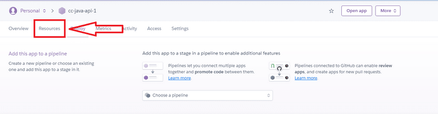
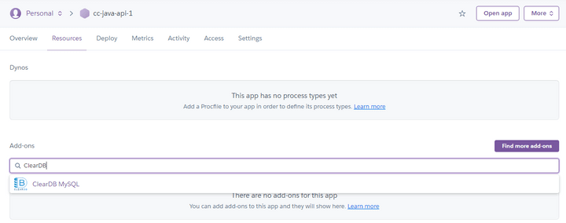
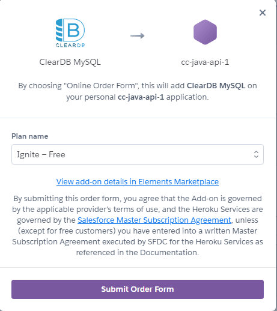
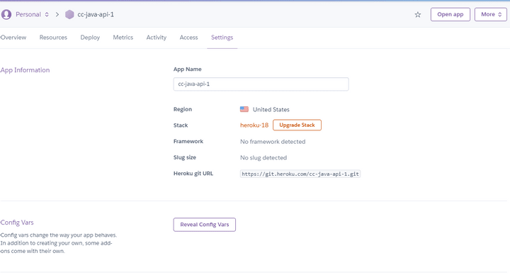
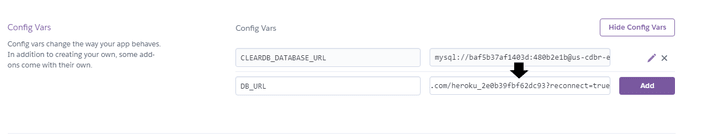

# Add ClearDB MySQL to the Application on Heroku

For this next step, navigate to the Resources tab near the top left of the dashboard, as shown in the following image:

`A red arrow points at the Resources tab near the top left of the Heroku dashboard.`

In the Resources tab, search for and provision an add-on called ClearDB MySQL, as shown in the following image:

`In the Resources tab of Heroku, the user has searched for "ClearDB" in the "Add-ons" search bar.`

The resulting modal will prompt you to "Submit Order Form". However, you won't being charged in any way. Follow the prompts and click "Submit Order Form", as shown in the following image:

`A purple button "Submit Order Form" button appears at the bottom of the modal to add ClearDB MySQL.`

Now navigate to the Settings tab. Just under the App Information frame, you'll see the Config Vars frame. Click the button that says "Reveal Config Vars", as shown in the following image:

`The "Reveal Config Vars" button appears in the Config Vars frame of the Heroku Settings tab.`

Let's create a new Config Var and name it `DB_URL`. Locate the `CLEARDB_DATABASE_URL` variable and copy the value, pasting it into the value portion of the newly created `DB_URL` variable. Click the Add button to save these settings, as shown in the following image:

`In the Config Vars frame of the Settings tab, the variable value for CLEARDB_DATABASE_URL has been pasted into the field next to DB_URL.`

Okay, those are all the basic settings we need to configure on Heroku! Now we can take the final steps to connect the GitHub repository to the Heroku platform.

---
© 2022 edX Boot Camps LLC. Confidential and Proprietary. All Rights Reserved.