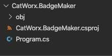

# Create a "Hello, World" App

How could we embark on learning a new programming language without creating a "Hello, World!" application? We'll initialize a new C# project using the dotnet executable, which creates a "Hello, World!" app for us.

## Create the CatWorx.BadgeMaker App

First, we'll create the badge-maker app by following this step:

* Navigate to the folder where you want your project to reside. At the command prompt, use dotnet to create the new console app called `CatWorx.BadgeMaker` by typing the following command:

```console
$ dotnet new console -o CatWorx.BadgeMaker
```

This command will create a new folder called `CatWorx.BadgeMaker` that will contain the C# project. Let's look at the project files.

## View the Project Files

To view the project files, follow these steps:

1. In VS Code, select File from the main menu, and choose "Open..."

2. Navigate to the `CatWorx.BadgeMaker` folder that dotnet created.

3. Double-click `CatWorx.BadgeMaker` to open it in the VS Code Explorer pane.

You should see something like the following image:



`A folder tree for CatWorx.BadgeMaker shows an obj folder, a CatWorx.BadgeMaker.csproj file, and a Program.cs file.`

Note that the project already contains the following files and folders:

* The `obj` folders shown in the preceding image are used by .NET Core to execute the C# code.

* The `CatWorx.BadgeMaker.csproj` file is very similar to a `package.json` file, which contains your program's dependencies and packages.

* The `Program.cs` file is where you'll develop the console application.

## The Program.cs File

Let’s look in the `Program.cs` file, shown here:

```console
// See https://aka.ms/new-console-template for more information
Console.WriteLine("Hello, World!");
```

This is the new template generated by .NET 6.0, that uses something called top-level statements, which is a feature to minimize the amount of code needed to start writing programs. To find out more about this, feel free to visit the link that is in the comment in this file. In order to better understand the importance of the `Program.cs` file, we are going to convert it back to a previous, more verbose version.

Replace the contents of `Program.cs` with the following:

```cs
using System;

namespace CatWorx.BadgeMaker
{
  class Program
  {
    static void Main(string[] args)
    {
      Console.WriteLine("Hello, World!");
    }
  }
}
```

We'll review the contents of this file shortly.

## Run the "Hello, World!" App

To run the app, follow these steps:

1. At the command line, navigate to the `Catworx.BadgeMaker` folder.

2. Type the command `dotnet run`. The output will read, `Hello, World!`.

Congratulations—you've written your first C# program! Next you'll explore this C# app further to learn how it works.

---
© 2022 edX Boot Camps LLC. Confidential and Proprietary. All Rights Reserved.