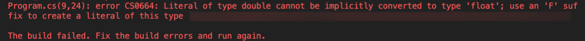
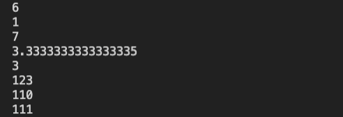
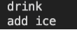

# C# Data Types

Like JavaScript, C# has various data types that can store values, each with their own set of properties and unique behavior.

However, unlike JavaScript, C# is a **statically typed language**. This means that the data type is explicitly labeled when a variable is declared. In JavaScript, declaring a variable with the keyword `var` allows the data type to be inferred; in contrast, C# variables MUST be declared with a data type.

Let's compare and contrast a JavaScript code block and a C# code block that declare variables for a car model and price.

Here's the JavaScript code block:

```javascript
// JavaScript
var carModel = "Explorer";
var carPrice = 500;
```

Here's the C# code block:

```cs
// C#
string carModel = "Intrepid";
int carPrice = 500;
```

As you can see, in the C# code block, the data types are explicitly defined when the variables are declared. The `carModel` variable was declared as a `string`, and `carPrice` was declared as `int` (an integer).

Statically typed languages have several advantages, namely that compilers are more likely to catch errors automatically early on, making the code more reliable and stable.

## Strings

Just as in JavaScript, C# strings store plain text. Let’s explore strings by doing a little coding. We'll type some code examples in `Program.cs` and then run the app using `dotnet run` to see the output printed in the console.

Type the following code inside the `Main()` method and try to guess what the outcome will be before executing the program:

```cs
string greeting = "Hello";
greeting = greeting + "World";
Console.WriteLine("greeting" + greeting);
```

Notice how the variable `greeting` is declared as a string data type. In C# it is necessary to use double quotes, or `""`, in order to define a string. Although JavaScript also allows single quotes or backticks to express a string, C# does not allow this flexibility.

## String Interpolation

There are a few other ways to print variables in C#. You might recognize some similarities to JavaScript in the following code example:

```cs
Console.WriteLine($"greeting: {greeting}"); 
Console.WriteLine("greeting: {0}", greeting);
```

In the preceding code block, the first statement interpolates the variable `greeting` with the use of the `$`, and curly braces surround the variable (`{greeting}`). The second statement interpolates the variable `greeting` by associating the zero index with the second argument of the function call.

## Numbers

Just like JavaScript, C# number data types are used to store numbers. They have unique properties inherent to the number data type.

For example, integer values and decimal values have different data types in C#, as is the case in virtually all programming languages. Can you guess which is which in C#? That’s right—`int` for integers and `float` for decimals.

**Deep Dive**

> For more information, refer to the [Microsoft Docs on C# built-in types](https://docs.microsoft.com/en-us/dotnet/csharp/language-reference/builtin-types/built-in-types).
  
## Example Math Operations

Now let's try an exercise to solve some basic math operations in C#. Try to solve the following problem by writing a solution in the `Main()` of the `Program.cs` file:

```
// How do you find the area of a square? Area = side * side
float side = 3.14;
```

Try to compute the solution programmatically by placing the code in the `Main()` function, and replace the "Hello, World!" statement in the `Program.cs` file. Then run the program with `dotnet run`.

If you get an error or get stuck, ask yourself the following questions:

* Do we need to declare the `area` as a variable?

* What data type should `area` be?

* What does the error suggest?

The following image shows an error in the console:



`The build error revealed in the console about converting data types.`

There are two ways that we could handle this error. The first solution involves changing the number to be a float. When we write a decimal with no suffix, it is by default the type `double`. If we want to convert the literal to be a float, we could use the `F` suffix suggested as shown in the following code:

```cs
float side = 3.14F;
float area = side * side;
Console.WriteLine("area: {0}", area);
```

Alternatively, we could change the type to `double` to match what the default type of a decimal with no suffix is. This solution is shown in the following code:

```cs
double side = 3.14;
double area = side * side;
Console.WriteLine("area: {0}", area);
```

How do we identify the data type of a variable? We use the `GetType()` function, as follows:

```cs
Console.WriteLine("area is a {0}", area.GetType());
```

**Deep Dive**

> For more information, refer to the [Microsoft Docs on floating-point numeric types](https://docs.microsoft.com/en-us/dotnet/csharp/language-reference/builtin-types/floating-point-numeric-types)

## Math Operators

Try to guess what the outcomes will be for the following lines of code, then run them in your `Main()` method:

```cs
Console.WriteLine(2 * 3);         // Basic Arithmetic: +, -, /, *
Console.WriteLine(10 % 3);        // Modulus Op => remainder of 10/3
Console.WriteLine(1 + 2 * 3);     // order of operations
Console.WriteLine(10 / 3.0);      // int's and doubles
Console.WriteLine(10 / 3);        // int's 
Console.WriteLine("12" + "3");    // What happens here?

int num = 10;
num += 100;
Console.WriteLine(num);
num ++;
Console.WriteLine(num);
```

After running the application using the `dotnet run` command, we should see the following results in the console:



`Math operation results are displayed in the console.`

The preceding results from these math operations perform as expected, similarly to JavaScript. Strings concatenate, and the math operators abide by operation order.

## Booleans

C# also has a separate Boolean type, `bool`. We can declare any variable as a type `bool` and assign the variable a `true` or `false` value, as seen in the following declaration:

```cs
bool isCold = true;
Console.WriteLine(isCold ? "drink" : "add ice");  // output: drink
Console.WriteLine(!isCold ? "drink" : "add ice");  // output: add ice
```

Run the preceding statements in the `Main()` function in the `Program.cs` file with the command `dotnet run` to see the following results:



`The results from the preceding statements are displayed in the console.`

---
© 2022 edX Boot Camps LLC. Confidential and Proprietary. All Rights Reserved.