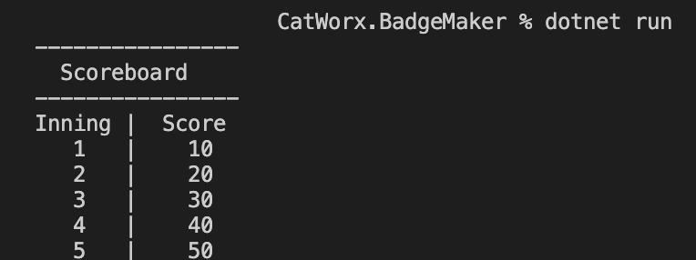

# Data Structures

In this section, we'll look at dictionaries, arrays, and lists in C#. These more complex data types allow us to store lots of data in a structured format. Similar to how JavaScript used arrays and object literals, C# uses these data structures to maintain large sets of data with different accessibility operations. Choosing the right data structure for the job will optimize application performance.

## Dictionaries

Similar to object literals in JavaScript, **dictionaries** in C# use a key-value pair relationship. But just as with the data types, the type of data that can be stored must be explicitly stated when the dictionary is declared.

To use a dictionary, you must first import `System.Collections.Generic` at the top of the `Program.cs` file, by typing the following command:

```cs
using System.Collections.Generic;
```

Data types for a dictionary's key-value pair types are declared in angled brackets, as shown in the following examples:

```cs
<string, double>
<int, string>
```

In the following code example, we're declaring that the variable, `myScoreBoard`, is a dictionary that has a string key and an integer value:

```cs
Dictionary<string, int> myScoreBoard = new Dictionary<string, int>();
```

To populate the dictionary, we use the `Add()` method in multiple lines to add data. See the following code for an example:

```cs
myScoreBoard.Add("firstInning", 10);
myScoreBoard.Add("secondInning", 20);
myScoreBoard.Add("thirdInning", 30);
myScoreBoard.Add("fourthInning", 40);
myScoreBoard.Add("fifthInning", 50);
```

Alternatively, we could initialize the dictionary by listing the key-value pairs in a function call. Using this method, we pass a comma-separated list of key-value pairs in curly braces, `{}`, for each entry we wish to create. See the following example:

```cs
Dictionary<string, int> myScoreBoard = new Dictionary<string, int>(){
    { "firstInning", 10 },
    { "secondInning", 20},
    { "thirdInning", 30},
    { "fourthInning", 40},
    { "fifthInning", 50}
};
```

This example is functionally equivalent to the first method.

## Populate a Dictionary

Now try this yourself. Use one of the preceding patterns to populate the dictionary `myScoreboard`. Then add the following code block to print the dictionary:

```cs
Console.WriteLine("----------------");
Console.WriteLine("  Scoreboard");
Console.WriteLine("----------------");
Console.WriteLine("Inning |  Score");
Console.WriteLine("   1   |    {0}", myScoreBoard["firstInning"]);
Console.WriteLine("   2   |    {0}", myScoreBoard["secondInning"]);
Console.WriteLine("   3   |    {0}", myScoreBoard["thirdInning"]);
Console.WriteLine("   4   |    {0}", myScoreBoard["fourthInning"]);
Console.WriteLine("   5   |    {0}", myScoreBoard["fifthInning"]);
```

Now run the code in the console with the command `dotnet run`. You should see the following in the console:



`A scoreboard is displayed with columns labeled "Inning" and "Score", with data populating several rows.`

## Arrays

Like in JavaScript, C# arrays are data structures that can store large amounts of data with similar accessibility features. As you'll recall, items in arrays can be accessed by their index, which starts at 0.

However, there are a couple of notable distinctions in the way C# handles arrays, because the data type of the array’s elements must be declared—just as we did for variables. This constraint allows for only a single data type to be contained in the array.

Another distinction is that the length of the array must also be set when the array is declared. No new elements can be added or subtracted from the array.

To declare an array in C#, we must declare the data type and size, as shown in the following code block:

```cs
string[] favFoods = new string[3]{ "pizza", "doughnuts", "icecream" };
string firstFood = favFoods[0];
string secondFood = favFoods[1];
string thirdFood = favFoods[2];
Console.WriteLine("I like {0}, {1}, and {2}", firstFood, secondFood, thirdFood);
```

## Declare an Array

Remove any previous code from the `Main()` function and replace it with the preceding code. Run the code from the command line with `dotnet run`.

You should see the following output to the console:

```console
I like pizza, doughnuts, and icecream
```

Thus, just as in JavaScript, we can access the array using `[]` and the array's index.

## Lists

C# lists might seem more similar to JavaScript arrays because their lengths are not static—they can expand to contain all the elements needed.

Like dictionaries, lists are located in the `System.Collections.Generic` namespace. So be sure to import this directive with the `using` statement at the top of the `Program.cs` file, as follows:

```cs
using System.Collections.Generic;
```

The following code block demonstrates how to declare a list and its data types using the angle bracket notation, similar to the dictionary:

```cs
List<string> employees = new List<string>() { "adam", "amy" };

employees.Add("barbara");
employees.Add("billy");
```

We also added more employee names using the `Add()` method.

Now that the list is populated with employee data, how can we access that list to print the employee names to the console?

**Hint**

> Leverage your knowledge of JavaScript arrays!
  
We'd use the following code to accomplish this:

```
Console.WriteLine("My employees include {0}, {1}, {2}, {3}", employees[0], employees[1], employees[2], employees[3]);
```

We used the same bracket notation, `[]`, that we used with arrays.

Can you predict what the output will look like here? Add this code to the `Main()` function and run the application to check whether your prediction was correct. You should get the following response:

```
My employees include adam, amy, barbara, billy
```

Simple but redundant. How can we keep the code DRY? Imagine a huge company that needs to create an employee list. Doing it this way would take forever! Is there a JavaScript solution for printing array elements that lends itself to a more automated process?

If you guessed loops, you're right! You'll explore those next.

---
© 2022 edX Boot Camps LLC. Confidential and Proprietary. All Rights Reserved.