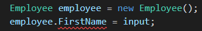
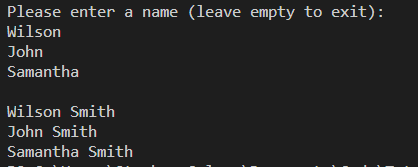

# Store the Employee Names

Let’s start adding properties to the `Employee` class in `Employee.cs`. We’re only dealing with an employee’s first name right now, so let’s start there. Like all variable declarations in C#, we must specify the type. We’ll store employees’ first names as strings in a property named `FirstName`.

Properties are declared in the body of a class, like in the following example:

```cs
class Employee
{
  string FirstName;
}
```

Similar to JavaScript, this property can be accessed directly on an `Employee` instance using dot notation. For example, we could set this property inside the `Main()` method of `Program`, as shown in the following image:



`In the CLI, the first line of code reads, "Employee employee = new Employee();", followed by "employee.FirstName = input;"`

But VS Code doesn’t like this, as indicated by the red squiggly line. If you try to run the program, you'll get the following warning:

```console
Program.cs(22,26): error CS0122: 'Employee.FirstName' is inaccessible due to its protection level
```

## Protection Levels

What’s a **protection level**? By default, properties and methods defined in a class are given the protection level of **private**, which means that they can only be accessed within the class itself. If we try to access a private property from outside the class, we'll get an error. Fortunately, we can control the access level of properties when we declare them, using an **access modifier**.

The following example shows how we'd explicitly set the access level for the `FirstName` property when we declare it:

```cs
class Employee
{
  private string FirstName;
}
```

This is equivalent to the default access level of properties when we don’t explicitly define an access level. Can you guess the name of an access modifier that would allow us to access `FirstName` from within `Program`? Here's a hint—it's the opposite of private.

If you guessed **public**, you’re right! While there are several access levels, you'll use only public and private in the scope of this tutorial.

**Deep Dive**

To learn more, refer to the [Microsoft Docs on access modifiers](https://docs.microsoft.com/en-us/dotnet/csharp/programming-guide/classes-and-structs/access-modifiers).

Let’s make `FirstName` accessible from `Program` by changing the access modifier to `public`, as shown in the following example:

```cs
class Employee
{
  public string FirstName;
}
```

When you save `Employee`, you’ll see that the red squiggly line under `FirstName` in `Program` has disappeared. If you run the application, you'll see that it no longer returns an error about protection levels.

So why do public and private access modifiers even exist? After all, JavaScript doesn’t use access modifiers, and it’s one of the most popular programming languages in the world! Well, you might have seen JavaScript developers prepend variables with one or more underscores, like `_sum,` `__currentIndex`, or `_calculateCatDensity()`. This convention simulates private variables. It’s like a signal to other developers not to reference the variable anywhere else—even if JavaScript allows it—because it only makes sense in that one spot.

In contrast, C# and other languages make access levels a first-class language feature, giving developers full control over where properties or methods can be used. By declaring something as private, we can be assured that it won’t leak out of the class and cause damage elsewhere; if we declare something as public, we’re confident that it’s safe everywhere.

This concern about property access is part of the object-oriented software design principle of **encapsulation**. We’ll talk a little bit more about this as we flesh out `Employee`.

Let’s add the rest of the properties that we care about to the `Employee` class, making all of the properties `public` (for now), so that we can access them from `Program`. We'll do this with the following code:

```cs
class Employee
{
  public string FirstName;
  public string LastName;
  public int Id;
  public string PhotoUrl;
}
```

## Constructors

Okay, so now we can store values for these properties. But we still need to set values for each employee! Thanks to C#’s special **constructor method**, we can set values all at once when we create a new instance of the `Employee` class. The following example shows this easy, intuitive way to instantiate an `Employee` when we have all of the necessary values handy:

```cs
Employee currentEmployee = new Employee("Vince", "McMahon", 123, "https://placekitten.com/300/300");
```

You're probably familiar with JavaScript constructors, which are called in exactly the same way—by passing values to a class as arguments in parentheses, as follows:

```javascript
var date = new Date('December 17, 1995 03:24:00');
var regex = new RegExp("Fudge\\WSauce\\!?");
var fancyPants = new Pants("fancy");
```

There are two popular constructor styles in JavaScript. Before ECMAScript 2015, constructor functions were commonly defined implicitly in class-like functions. See the following example:

```javascript
var Employee = function(firstName, lastName) {
  this.firstName = firstName;
  this.lastName = lastName;
  this.isEmployeeBob = function(name) {
    return name === "Bob";
  }
}
```

There's no obvious constructor here, just the magical behavior that assigns arguments from `var e = new Employee("John", "Smith")` to a mysterious place called `this`. We called it a constructor because it behaved similarly to conventional constructor methods in object-oriented programming languages. It was common to define ALL of a class's properties and behaviors within this function.

In JavaScript, we learned about OOP, classes, and constructor methods. We can define a class in JavaScript as follows:

```javascript
class Employee {
  constructor(firstName, lastName) {
    this.firstName = firstName;
    this.lastName = lastName;
  }

  isEmployeeBob(name) {
    return name === "Bob";
  }
}
```

A constructor makes it clear exactly what needs to happen before an instance of the class is returned to the new operator. And thanks to the class syntax, other functions could be defined outside of the constructor for better clarity and organization. It's also much closer to the way in which constructor methods work in true object-oriented languages—like C#!

In C#, a class's constructor method has the same name as its class, as shown in the following example:

```cs
class Employee
{
  public string FirstName; 
  public string LastName;
  public Employee(string firstName, string lastName) 
  {
    FirstName = firstName;
    LastName = lastName;
  }
}
```

You might notice the following differences in the C# version:

* Properties must be declared in the class before you can use them.

* The constructor method must be made public.

* To distinguish between public and private variables, use PascalCase for public variables and camelCase for private variables.

Why do you think the constructor must be made public?

**Hint**

> The new operator calls a class's constructor immediately before returning an instance of the class.

If the constructor were defined as private, the new operator wouldn't be able to call it, and it wouldn't be able to return an instance of the class. There are some cases in which this can be useful, but we won't deal with any such situations for now.

Using the preceding C# example as a guide, try to update `Employee` to add a constructor that accepts a first name and sets the `FirstName` property.

You should now have an `Employee` class that looks like the following example:

```cs
class Employee
{
  public string FirstName;
  public string LastName;
  public int Id;
  public string PhotoUrl;
  public Employee(string firstName) {
    FirstName = firstName;
  }
}
```

Now that we can set the employee's first name when we instantiate `Employee`, let's update `GetEmployees()` in `Program`, as shown in the following example:

```cs
// Create a new Employee instance

Employee currentEmployee = new Employee(input);
employees.Add(input);
```

In `Employee.cs`, revise the `Employee` constructor to include the `lastName`, as shown in the following code:

```cs
Employee(string firstName, string lastName) {
  FirstName = firstName;
  LastName = lastName;
}
```

Later, we'll update the CLI logic to collect all of the employee values from the user. For now, let's always set the last name to "Smith." In `Program`, add the following code:

```cs
// Create a new Employee instance
Employee currentEmployee = new Employee(input, "Smith");
employees.Add(input);
```

Now we can create an `Employee` instance and set its `FirstName` and `LastName` properties in one statement. How might we put an employee's entire name (for example, "John Smith") in the employees list? The following code shows one way to do that:

```cs
employees.Add(currentEmployee.FirstName + " " + currentEmployee.LastName);
```

Following this approach, every time someone uses an `Employee` instance to get an employee's entire name, they'd have to handle the formatting. As the application grows and the `Employee` class is used in more situations, a lot of similar code would have to be written in the calling classes. Let's make `Employee` more user-friendly by creating a `GetFullName()` method that does that work, returning a nicely formatted, full name.

Update `Employee` as follows:

```cs
public Employee(string firstName, string lastName) {
  FirstName = firstName;
  LastName = lastName;
}

public string GetFullName() {
  return  FirstName + " " + LastName;
}
```

By now it should be little surprise that type declarations are required in method definitions. In addition to the access modifier `public`, we also define the type of value that `GetFullName()` will return. Like the `GetEmployees()` method in `Program`, this method returns something too—a string. So we must add this keyword to the method declaration.

Let's update `Program` to use this handy method, as follows:

```cs
// Create a new Employee instance
Employee currentEmployee = new Employee(input, "Smith");
employees.Add(currentEmployee.GetFullName());
```

When we run the application, we're still prompted for first names. But the resulting list prints each employee's full name, as shown in the following image:



`After the prompt to enter a name for employees, the application prints "Wilson Smith", "John Smith", and "Samantha Smith".`

---
© 2022 edX Boot Camps LLC. Confidential and Proprietary. All Rights Reserved.