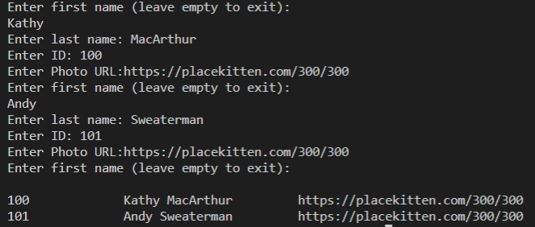

# Collect and Print All Employee Property Values

Now we can go back to `Program` and pass specific values in the `Employee` instances. We hardcoded "Smith" for `lastName`, and we could hardcode the other values too. But at some point hardcoding won't be sufficient anymore—we'll need to get all the values from the user, via the CLI. To that end, how could we alter the user input logic to ask for each property for every employee?

**Hint**

> You can call `Console.ReadLine()` multiple times in a row.
  
We could do this a few different ways, but a straightforward solution is to call `Console.ReadLine()` for each value we want from the user. Let's update the `GetEmployees()` method in `Program` to do this. Take care to set the variables to the correct types, corresponding to the property types for `Employee`. See the following example for reference:

```cs
static List<Employee> GetEmployees()
{
List<Employee> employees = new List<Employee>();
while(true) 
{
  // Move the initial prompt inside the loop, so it repeats for each employee
  Console.WriteLine("Enter first name (leave empty to exit): ");

  // change input to firstName
  string firstName = Console.ReadLine() ?? "";
  if (firstName == "") 
  {
    break;
  }

  // add a Console.ReadLine() for each value
  Console.Write("Enter last name: ");
  string lastName = Console.ReadLine() ?? "";
  Console.Write("Enter ID: ");
  int id = Console.ReadLine() ?? "";
  Console.Write("Enter Photo URL:");
  string photoUrl = Console.ReadLine() ?? "";
  Employee currentEmployee = new Employee(firstName, lastName, id, photoUrl);
  employees.Add(currentEmployee);
  }

  return employees;
}
```

That's a lot of code, so let's walk through it. (We'll talk about the red squiggly line under the id assignment in a minute.)

First we moved the initial `Console.ReadLine()` prompt inside the `while` loop so that it repeats for each new employee entry. Then we changed input to `firstName`, because that's how we've been using it all along. Now that we have other values to capture, it makes sense to be more specific. Next we called `Console.ReadLine()` three more times, capturing `lastName`, `ID`, and `photoUrl`.

Note that if a highlight appears on `ID` from the IDE, it might be because `Console.ReadLine()` returns only string types. We want to store it in an `int` variable type, consistent with how `Employee` stores it, and that's not possible in C#.

Fortunately, several C# utilities enable us to alter, or cast, values from one type into another. To store a string as an integer, we can use the `Int32.Parse() `method. This is similar to the `parseInt()` function in JavaScript. Let's update that line to turn the `Console.ReadLine()` string into an `int`, as follows:

```cs
Console.Write("Enter ID: ");
int id = Int32.Parse(Console.ReadLine() ?? "");
```

Now VS Code should be happy. Let's save and run the application to confirm that everything works!

**Pro Tips**

> When prompted for the photo URL, you can use [Place Kitten](http://placekitten.com/). All you have to do is type your desired image width and height after their URL (for example, [https://placekitten.com/300/300](https://placekitten.com/300/300)), and Place Kitten will provide a placeholder kitten photo in that size!
  
The application works, but it still prints only the employee's name to the console. We want to see ALL of the employee's information. To print more than just the name, we need to get it out of the `Employee` instance.

Earlier in the project, we used dot notation to access `Employee` instance properties directly, but we've also used a method to access `Employee`'s `FirstName` property. The argument for the latter approach was to simplify formatting. But we might opt to access properties indirectly through methods for any of the following reasons:

* You can process the property (such as formatting or validating it) before returning it.

* You can change the type of the value before returning it.

* You can provide a stable interface to the property, even if it changes internally. For example, `GetId()` will always return an integer `ID`. But maybe in the future, the class will query a database to find the id based on the employee's name, which would be a string and would therefore require type conversion.

* You can return different values based on the time of day (for instance, `GetGreeting()` might return `"Good Morning"` before noon and `"Good Afternoon"` later).

You'll encounter plenty of other advantages as needs arise!

We mentioned the software design principle of encapsulation earlier. In short, users of a class shouldn't have to know how it operates or stores values. They should only need to know what the inputs and outputs are. It's a best practice to use methods to set and get properties on a class instance, thus enhancing encapsulation.

Phew again! Having said all that, we'll create methods inside `Employee` to return the remaining properties. Also, to double-down on encapsulation, we'll change all of the property access modifiers to `private` to ensure that users of this class can only access them through the methods we provide.

The following code shows the final `Employee` class:

```cs
namespace CatWorx.BadgeMaker {
  class Employee
  {
    private string FirstName;
    private string LastName;
    private int Id;
    private string PhotoUrl;
    public Employee(string firstName, string lastName, int id, string photoUrl) {
        FirstName = firstName;
        LastName = lastName;
        Id = id;
        PhotoUrl = photoUrl;
    }
    public string GetFullName() {
        return  FirstName + " " + LastName;
    }
  
    public int GetId() {
        return Id;
    }

    public string GetPhotoUrl() {
        return PhotoUrl;

    }
  }
}
```

The last step of this section is to print out all of the employee information for each employee. In the `PrintEmployees()` method of `Program`, update the code in the `for` block as follows:

```cs
for (int i = 0; i < employees.Count; i++) 
{
  string template = "{0,-10}\t{1,-20}\t{2}";
  Console.WriteLine(String.Format(template, employees[i].GetId(), employees[i].GetFullName(), employees[i].GetPhotoUrl()));
}
```

What's up with that mess of characters in the template string? You might recognize `String.Format()` from its brief introduction earlier. In C#, `String.Format()` works similarly to template literals in JavaScript; it takes a string to use as a template and then fills in the placeholders with values. But in C#, each placeholder can define how its value is formatted, and the values follow the template in the list of arguments.

Let's walk through the formatting string `string template = "{0,-10}\t{1,-20}\t{2}";`.

We want the first argument (argument `{0}`), the id, to be left-aligned and padded to at least 10 characters, so we enter `{0,-10}`. Then we want to print a tab character (`\t`). We want the next argument (`{1}`), the name, to be left-aligned and padded to 20 characters—hence `{1,-20}`.

Next, we want to print another tab character (`\t`). And finally, we want to print the last argument (`{2}`), the photo URL, with no formatting: `{2}`.

Put that all together, and it makes `{0,-10}\t{1,-20}\t{2}`, which is the formatting formula for the output.

The results will look like the following image:



`The app prompts users to enter first name, last name, ID, and photo URL for employees, then prints a list.`

**Deep Dive**

> To learn more, refer to the [Microsoft Docs on the String.Format method](https://docs.microsoft.com/en-us/dotnet/api/system.string.format?view=net-5.0).

---
© 2022 edX Boot Camps LLC. Confidential and Proprietary. All Rights Reserved.