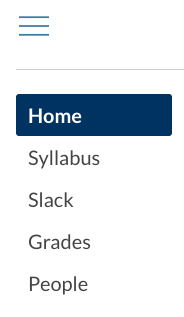

# 1.3.1 Get Started in Bootcamp Spot
To participate in this course, you need to know a few basic things about Bootcamp Spot, the learning platform we'll be using. You'll learn more about this system as you progress through the course, and you can always consult the official Bootcamp Spot documentation for more information.

For now, here's what you need to know:

* How to navigate Bootcamp Spot to complete this course

* How to submit your assignments

* How to update your profile in Bootcamp Spot and add your picture

## Navigate Bootcamp Spot
Bootcamp Spot navigation consists of **global navigation**, **course navigation**, and **module navigation**.

* **Global navigation** is used to access your Account/Profile, Dashboard, Courses list, and Calendar. Global navigation is found on the lefthand side of the screen, listed from top to bottom:

* **Course navigation** is used to move between the different areas of your course, like Syllabus, Modules, Slack, Grades, and People. Course navigation is found just to the right of the global navigation and can be collapsed for more screen space:

* **Module navigation** is used to move through your course content. You can access specific items in the modules, see a module overview from the Modules page, and navigate among pages in a module:

The Previous and Next buttons appear the bottom of each page, allowing you to navigate within the module:

## Update Your Time Zone
Because this is an online course, it's likely that your classmates and instructional team will span multiple time zones. Check to make sure that your time zone is correct so that you don’t miss an important deadline or live session.

1. In the global navigation menu on the lefthand side of the screen, click Account:

2. Click Settings to access your settings page:

3. On this page, you'll see the language and time zone that your account is currently set to. If these settings are correct, you can stop here. If not, continue to Step 4.
   

4. On the righthand side of the page, click Edit Settings:

5. Click the Time Zone dropdown menu and select the one that matches your location:
   

6. Click Update Settings to save your settings:

7. Verify that the correct time zone is showing for your account.

## Submit Assignments in Bootcamp Spot
You'll submit homework assignments and links to your GitHub projects directly in Bootcamp Spot. To submit assignments, follow these steps:

1. Access the Assignment/Challenge page in Bootcamp Spot to view the assignment instructions.

2. When you're ready to submit the assignment, click Submit Assignment:

3. You'll be shown the submission page, where you will see one of the following things:

* A Text Entry box for assignments that must be entered as text:

* A Website URL box for submitting a link. This could be a link to your homework stored on GitHub or another link as required in the assignment instructions:
  

* A Choose File button, where you can upload a file directly into Bootcamp Spot:

4. When you've entered your text, URL, or file upload, you're ready to submit! Just click the Submit Assignment button:

---
© 2022 edX Boot Camps LLC. Confidential and Proprietary. All Rights Reserved.