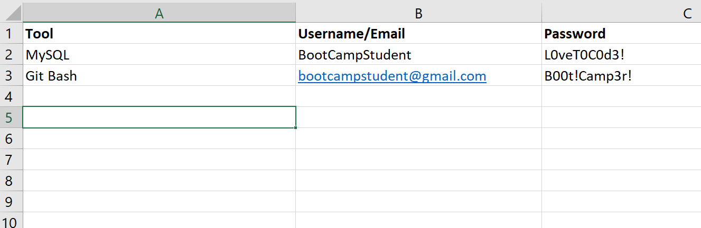

# 1.8.1 Manage Your Passwords

During this course, you'll be required to create logins for several websites and tools on your computer. This might be the first time you've had to keep track of such a large number of usernames and passwords.

It's important that you start this course with a good strategy for managing your usernames and passwords.

## Password Managers

Several services exist to help you manage your passwords. These `password managers` usually require you to create one primary password for their service. You can then add websites to the manager and store your `credentials` there. In this context, credentials refers to your login email/username and password. This means you only have to remember one password—the password manager takes care of the rest!

There are both free and pay sites that you can use to manage your passwords. One popular, free, and easy-to-use password manager is [LastPass](https://lastpass.com/create-account.php). Other popular (pay) services are [Dashlane](https://www.dashlane.com/lp/neverforget-teal/), [Bitwarden](https://bitwarden.com/), and [1password](https://1password.com/).

You aren't required to use a password manager for this course, but using a free service like LastPass might save you some time and effort—and quite possibly some headaches if you happen to forget a password or two!

## How to Store Credentials for Your Tools

You will also create credentials for the tools on your computer. An easy way to keep track of these is to create a spreadsheet using a program like Microsoft Excel.

Just add the name of the tool, your username, and your password to each line in the spreadsheet as you create logins. This will ensure that you don't lose track of your credentials.

---
© 2022 edX Boot Camps LLC. Confidential and Proprietary. All Rights Reserved.