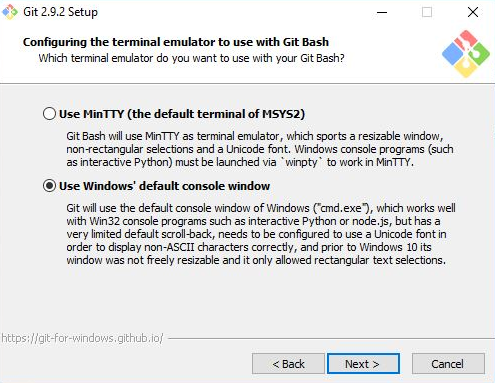

# 2.2.2 Install Your Tools (Windows)

In this assignment, you'll install the required tools and software for the course. There's a lot to get through, so buckle in and get ready!

## Before You Begin

First, create accounts for the following services. Don't just create login credentials; job recruiters often scour these sites in search of candidates, so be sure to provide at least a headshot and contact information.

* [LinkedIn](https://www.linkedin.com/).

> NOTE
>
> You should create a full LinkedIn profile highlighting your skills and work experience, and include a headshot.

* [GitHub](https://github.com/).

* [Stack Overflow](http://stackoverflow.com/).

In addition, be sure to accept the invite for your section on [Slack](https://slack.com/). You'll receive the link to your class-specific channel during orientation. If you don't receive this email, contact your Student Success Manager for assistance.

## Tool and Software Installations

Follow these instructions to complete the installation process for all of the required tools.

## Google Chrome

1. If you don’t already have it installed, download [Google Chrome](https://www.google.com/chrome/browser/desktop/index.html).

2. Download, open, and run the installation file.

## Screencastify

> NOTE
>
> You must use Google Chrome to install and use Screencastify.

1. Open Google Chrome.

2. Go to the [Chrome Web Store](https://chrome.google.com/webstore/category/extensions) and type "Screencastify" in the Search Extensions bar in the top left of the page.

**Note**: You can also start by going to the [Screencastify website](https://www.screencastify.com/) and clicking the "Add to Chrome" button, which will take you directly to its listing in the Chrome Web Store.

1. Click the "Add to Chrome" button.

2. Click "Add extension".

3. When the download is complete, click the gray filmstrip icon in the top-right corner of your browser screen to launch Screencastify.

## Allow Webcam and Microphone Access

The first time you click on the Screencastify icon, you'll be asked to give Screencastify permission to access your webcam and microphone, which enables you to narrate over your recordings as well as record your webcam. You're required to allow access in order for the Screencastify extension to function properly. You do not need to include audio or video in your recordings, and Screencastify never records audio or video unless you expressly ask it to.

1. Click the **Setup Camera Access** button.

2. Click Allow in the pop-up window.

**Note**: If Screencastify can't detect your microphone, read this [Screencastify article about fixing microphone audio](https://help.screencastify.com/article/206-i-dont-hear-any-audio-from-my-microphone). If it can't detect your webcam, read this [Screencastify article about troubleshooting undetected webcam](https://help.screencastify.com/article/205-my-webcam-is-not-detected)s.

## Connect Your Google Drive to Screencastify

It is recommended that you save all of your Screencastify recordings to Google Drive, which is safer than storing them locally on your computer. If you connect your Google Drive to Screencastify, your recordings will be saved there automatically. The length of this process depends on how long a particular recording is.

> NOTE
>
> Screencastify never views, modifies, stores, or in any way interacts with the other files in your Google Drive.

The first time you open the Screencastify extension, you'll be asked where you want to store your recordings (right after you allow webcam and microphone access). Follow these steps:

1. Confirm that Google Drive is selected, then click "Next".

2. Sign in to your Google account.

> NOTE
>
> You can sign in with any Google account, not just an `@gmail.com` address.

3. Give Screencastify permission to access your Google Drive, as shown in the following animation:

And that's all you need to do! As soon as you finish your first recording, a new folder named `Screencastify` will be created in your Drive. All of your recordings will be saved in this folder.

The videos you'll see in "Your Recordings" in Screencastify sync with this `Screencastify` folder in your Drive. This means the following:

* If you delete a video in `Screencastify`, it will also be deleted from your Drive.

* If you move a video out of the `Screencastify` folder in your Drive, it will no longer be accessible from "Your Recordings" in Screencastify.

* If you rename a video in `Screencastify`, it will also be renamed in your Drive.

You can always change the default storage location for your recordings, even after initial setup. Simply open the extension menu and click Options. The first thing you'll see is an option to select where you want to store your recordings.

Want to know how to record, save to your Google Drive, and share your recordings? We've included a tutorial at the end of this lesson.

## Slack
1. Go to [Slack for Windows](https://slack.com/downloads/windows). Click Download.

2. When the installation is complete, add our channel to your application.

3. Click the header of your current Slack channel.

4. Select "Sign in to another team".

5. Enter the Slack domain provided to you during orientation.

6. Enter the email address that the Slack invite was sent to, and your password. When you see the chatroom, you're finished.

## VS Code

Go to the [setup page](https://code.visualstudio.com/docs/setup/setup-overview) on the VS Code website and select Windows as your platform.

2. Click "Visual Studio Code installer" in Step 1 under the Installation heading.

3. Open and run the installer file, which will look like this image:

4. Follow the installer prompts. When you reach the screen shown here, select the highlighted settings (every option listed under Other) and click Next.

> NOTE
>
> When the installation is complete, you should be able to access VS Code from your Start menu.

## Open in Browser (VS Code Extension)

1. Open VS Code.

2. Open the extensions pane and search for "open in browser".

3. Select the version written by TechER and click Install, as shown in the following image:

## Git and Git Bash

1. Go to the [Git downloads page](https://git-scm.com/downloads). Select the download for Windows. It should automatically download the most up-to-date version.

2. Use Next to progress through the installation until you get to the screen that asks you to choose a default editor for Git. Select "Use Visual Studio Code as Git's default editor".

3. When you see a prompt like this, select "Checkout as-is, commit Unix-style line endings".

4. Finally, select "Use Windows' default console window".

Any settings not mentioned here can be left in their default mode.

## SSH Keys

To complete these steps, you'll need to sign up for a [GitHub](https://github.com/) account if you haven't already.

## Check for Existing SSH Keys

To check if you already have existing SSH keys on your computer, read the [GitHub Docs on checking for existing SSH keys](https://docs.github.com/en/authentication/connecting-to-github-with-ssh/checking-for-existing-ssh-keys) and follow their directions.

> IMPORTANT
>
> Make sure you follow the instructions for Windows.

Here is a brief summary of the steps:

1. Enter l`s -al ~/.ssh` in your terminal (Git Bash for Windows or Terminal for macOS) to see if any existing SSH keys are present. Look for a public SSH key that ends in `.pub`. For example, `id_rsa.pub`, `id_ecdsa.pub`, or `id_ed25519.pub`.

2. If you see an existing SSH key pair (a public SSH key like `id_rsa.pub` and a private SSH key like `id_rsa`), then you can skip generating a new SSH key and use your existing keys to add to the `ssh-agent` in a later step.

3. If you receive an error that it doesn't exist, that means you'll need to generate a new SSH key pair, which we will do next!

When in doubt, refer to the official documentation from GitHub.

## Generate an SSH Key

To generate an SSH key, read the [GitHub Docs on generating a new SSH key](https://docs.github.com/en/authentication/connecting-to-github-with-ssh/generating-a-new-ssh-key-and-adding-it-to-the-ssh-agent#generating-a-new-ssh-key) and follow their directions for your operating system.

Here is a brief summary of the steps:

1. Enter `ssh-keygen -t ed25519 -C “your_email@example.com”` in your terminal to create a new SSH key.

2. When prompted, save your key in the default file location and create a secure passphrase.

Again, if you get stuck, refer to the official documentation from GitHub.

## Add the SSH Key to the `ssh-agent`

Once you have your SSH keys, whether they were already existing or generated by the previous step, you can add them to the `ssh-agent` by reading the [GitHub Docs on adding your SSH key to the ssh-agent](https://docs.github.com/en/authentication/connecting-to-github-with-ssh/generating-a-new-ssh-key-and-adding-it-to-the-ssh-agent#adding-your-ssh-key-to-the-ssh-agent) and following their directions for your operating system.

> NERD NOTE
> 
> The ssh-agent is a program that keeps track of a user's identity keys and passphrases.

Here is a brief summary of the steps:

1. Enter `eval “$(ssh-agent -s)”` in your terminal to start the `ssh-agent`.

2. Add your private SSH key to the `ssh-agent` using the `ssh-add` command.

## Add the SSH Key to GitHub

Now that you've generated an SSH key, you can add it to your GitHub account by reading the [GitHub Docs on adding a new SSH key to your GitHub account](https://docs.github.com/en/authentication/connecting-to-github-with-ssh/adding-a-new-ssh-key-to-your-github-account) and following their directions for your operating system.

> IMPORTANT
> 
> Make sure that you are using the directions for adding the SSH key with a "Web Browser" and **NOT** with "GitHub CLI". Here is a brief summary of the steps:

1. Copy the public SSH key to your clipboard. Be sure **not** to copy anything else after this point so that your SSH key stays on your clipboard!

2. Navigate to the GitHub website and log in to your account.

3. Click on Settings, and then click on SSH and GPG keys.

4. Add your SSH key.

## Set Your Git Username for Every Repository on Your Computer

Git uses a username to associate commits with an identity. The Git username is different from your GitHub username.

You can change the name that's associated with your Git commits using the `git config` command. The new name you set will be visible in any future commits you push to GitHub from the command line. If you'd like to keep your real name private, you can use any text as your Git username.

Changing the name associated with your Git commits using `git config` will only affect future commits and will not change the name used for past commits.

To learn more, see [GitHub's documentation on setting your git username for every repository on your computer](https://help.github.com/en/github/using-git/setting-your-username-in-git#setting-your-git-username-for-every-repository-on-your-computer):

## Set Your Email Address for Every Repository on Your Computer

GitHub uses the email address set in your local Git configuration to associate commits pushed from the command line with your GitHub account.

You can use the `git config` command to change the email address you associate with your Git commits. The new email address you set will be visible in any future commits you push to GitHub from the command line. Any commits you made before changing your commit email address are still associated with your previous email address.

To learn more, see [GitHub's documentation on setting your email address for every repository on your computer](https://help.github.com/en/github/setting-up-and-managing-your-github-user-account/setting-your-commit-email-address#setting-your-commit-email-address-in-git):

For more information on commit email addresses, including your GitHub-provided `noreply` email address, see the [GitHub article entitled "About commit email addresses."](https://help.github.com/articles/about-commit-email-addresses/)

## Prework Support

Looking for prework support? Our team of tutors are eager to help! Request a tutor session with the following steps:

1. Click on "Student Support" in the left-hand navigation

2. Fill out the form marked "How can we help?" by entering your name, email, and by selecting "Student"

3. Select "Pre-work Support" from under "Question Category", "Pre-work Assistance" under "Question Sub Category", and enter the issue you're having

---
© 2022 edX Boot Camps LLC. Confidential and Proprietary. All Rights Reserved.