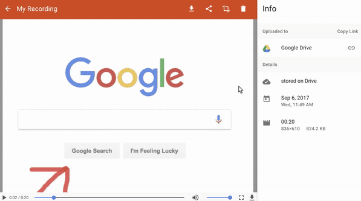

# 2.2.4 Screencastify Tutorial

Take a few minutes to get oriented in Screencastify before the course begins. You should have already installed Google Chrome and the Screencastify extension. You should have also created a Google account, as you'll be saving your recordings to your Google Drive.

## Start a Recording

1. Click the Screencastify extension icon.

2. Choose what you want to record: your browser tab, entire desktop, or webcam.

3. Check the Microphone box to narrate over your recording using an internal or external microphone.

4. Check the box next to "Tab Audio" or "System Audio" to capture the audio originating from within your browser tab or application (e.g., from a video being played).

5. (Optional) Check the box next to "Embed webcam".

6. Click Record. You'll see and hear a countdown, and then your recording will begin.

> NOTE
> 
> When Screencastify is recording, a red dot will appear in your extension icon.

## End a Recording

1. Click the extension icon again and then click "End Recording".

2. You'll automatically be taken to the recording's Video Page, where you can edit, save, and share your recording.

> NOTE
>
> You can also pause and resume a recording.

## Save a Recording to Google Drive

After connecting Screencastify to your Google Drive, every recording you make will automatically be saved to your Google Drive in a folder named Screencastify.

You can confirm that your recording has been saved to your Google Drive by checking the right sidebar of the Video Page, as shown in this animation:

This process could take a few minutes depending on how long your recording is.

If you delete a recording in Screencastify, it will also be deleted from your Drive. If you move a video out of the `Screencastify` folder in your Drive, you'll no longer see it in "Your Recordings" in Screencastify.

Your recording may appear blurry in your Google Drive immediately after uploading because Google processes the low-resolution version first. The full-resolution version of your video will be available within 15 minutes.

## Share a Recording with a Google Drive Link

When your Screencastify account is connected to your Google Drive, you can grab a link to your recording and share it wherever you'd like. You can get the Drive link for a recording through one of two ways. The first way is the following:

1. On the Video Page, click the share icon.

2. Select "Google Drive".

3. Click "Get Link".

4. Select your desired privacy settings for the recording.

5. Click "Copy Link" to copy the link to your clipboard.

The second way to get the Drive link for a recording is to click the paperclip icon next to Google Drive in the sidebar of the Video Page. The shareable link to the recording will automatically be copied to your clipboard, as shown in this animation:

> NOTE
> 
> If you make the entire Screencastify folder shareable, then anyone who has a link to that folder can view all of your past and future recordings.

---
© 2022 edX Boot Camps LLC. Confidential and Proprietary. All Rights Reserved.