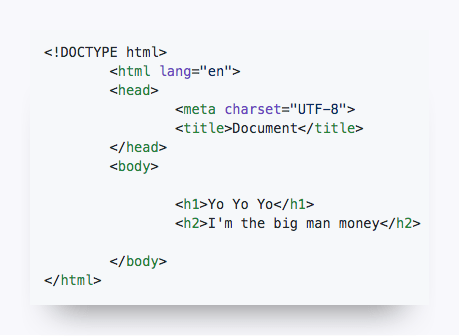
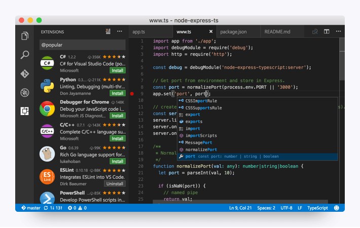
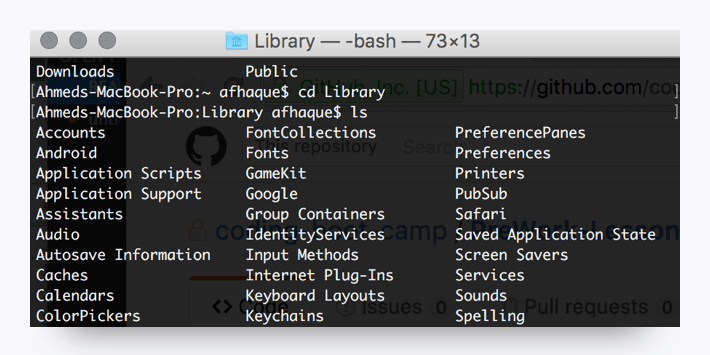

# 2.2.1 Install Your Tools

Proficiency in web and software development requires more than just a grasp of programming languages. Developers must also be familiar with the tools and technologies that allow them to create and share software with users around the world.

This course will expose you to a wide range of tools, some (or all) of which you may be unfamiliar with—tools with names like Heroku, Git, and npm. Although you may feel overwhelmed at first, these tools will soon become as familiar to you as a scalpel is to a surgeon.

This section will acquaint you with each of these tools, as well as help you set up all the necessary accounts and install the required programs on your machine.

## Ready for Action!

You should install the following tools before your first class to ensure you're ready to dive in on Day 1:

* Google Chrome

* Screencastify

* Slack

* Visual Studio (VS) Code

* Open in Browser (VS Code extension)

* Git Bash (Windows only)

* Terminal (Mac only; preinstalled)

* Git and GitHub

* Homebrew (Mac only)

* SSH keys

You should also create accounts for the following:

* LinkedIn

* GitHub

* Stack Overflow

* Slack

If you encounter any issues during setup, don't worry. The instructional staff will troubleshoot any errors and answer your questions on the first day of class.

## An Overview of Your Tools

This section provides an overview of the tools we'll use in the boot camp.

## Google Chrome

You'll use this web browser to quickly determine whether the code is working. Google Chrome has a number of tools that make it an ideal platform for coding, so if you're currently using a different browser, consider switching to Chrome.

## Screencastify

Screencastify is a free, lightweight extension for Google Chrome. We'll use this screen recorder to easily capture the desktop, browser, webcam, or certain applications.

## Slack

Slack is an online communication tool that's a mix of forum, instant messenger, and email all rolled into one. Countless organizations worldwide use this tool, and you'll use it every single day for the next six months.

We'll use Slack to send code snippets during class, relay important announcements, and facilitate group exercises. You'll receive the link to your class-specific channel during orientation. Although there's a Slack web client, for this course you should have the program installed on your machine.

## VS Code

Oh, the power of VS Code—a little program that does so much! Visual Studio (VS) Code is a free text editor that runs on Mac, Linux, and Windows operating systems.

A text editor is like the cozy pillow on which a developer rests their head. At a fundamental level, programming is all about creating text in files with various extensions. When we create a block of HTML, as shown in the following image, we've really just created a block of text, albeit with some funny symbols:

For a simple text editor, the comprehension stops there: the block of HTML remains a block of text. But more powerful text editors, like VS Code, immediately recognize these blocks of text as code (as long as we include the right file extension). VS Code can provide a more visually intuitive interpretation of the code through indicative coloring, smart tabs, and autocomplete functionality. As a result, creating HTML like the preceding block becomes a more natural process, and the code can be debugged more quickly.

Here's an example of code open in VS Code:

When you start working in VS Code, you might notice that one of its built-in features offers to autocomplete code while you're typing it. Don't be alarmed by this. You don't have to use the suggestions it provides, but this feature will save you time in the future as you continue to code.

## Open in Browser (VS Code Extension)

You'll soon learn that you can incorporate free VS Code add-ons to make the process of coding even easier than before.

For now, we only recommend installing one extension with VS Code: Open in Browser. This extension will allow you to open HTML files you're editing in VS Code in your web browser without having to go through File Explorer (Windows) or Finder (Mac).

## Git Bash and Terminal

Git Bash (for Windows users) and Terminal (for Mac users) each offer a command-line interface for working with the files and folders on your computer.

Maybe you're wondering if this is like Finder a Mac or Windows Explorer. Kind of, except that there are no pictures or visuals—just a box with text. But why would you want that? You'll learn over time that in many situations, using a command-line interface can be faster and more effective than relying on the operating system's **graphical user interface (GUI)**.

You'll get plenty of exposure to the command line at the beginning of the course. Here's an example of what it looks like:

## Git and GitHub

Working on code files is a collaborative process, as developers constantly build on each other's work. Git is a version-control system that offers a specialized set of strategies for orchestrating this collaboration, and GitHub stores these collaborative actions online. You can think of GitHub as a sort of Dropbox for coders. It offers a central place for developers to upload their code, view revision history, and make changes to a definitive set of files. You'll come to learn a lot about Git and GitHub in your first week of class. You'll receive the link to your class-specific repository during orientation.

## Xcode (Mac Only)

Xcode is a development suite exclusive to Mac. We'll primarily use VS Code in this course, but installing Xcode will set up some of the other required boot camp programs, including Git, which coders depend on for logging the development of programs and applications.

## Homebrew (Mac Only)

Homebrew is a Mac-specific tool kit that makes it easy to install a variety of applications using the command line. It can greatly simplify the installation process for various tools you'll use throughout your career.

## SSH Keys

Generating SSH keys allows developers to interface with certain remote services without having to constantly retype login information. You'll set up an SSH key for GitHub during the prework.

Without a key, you'll have to enter a password each time you push your code to GitHub, which would be as irritating as needing a key to open every door in your home.

## Ready, Set, Go!

Now it's time to collect your tools and begin. The following pages provide setup guides for both Windows and Mac users. If you're using a Windows machine, follow the instructions on the next page and skip the page with Mac instructions. If you're using a Mac, skip the following page and go to the next page.

There's a lot to install, but just follow the instructions closely and do your best with the information you have.

Throughout the course, you'll frequently need to install and use unfamiliar tools. Resist the urge to stop and ask, "Am I doing this right?" Instead, trust your instincts and take your best stab at it. If you get lost, instructional staff will help you. You can do this!

---
© 2022 edX Boot Camps LLC. Confidential and Proprietary. All Rights Reserved.