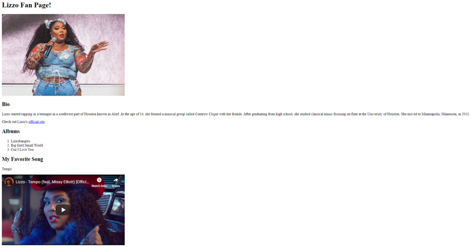
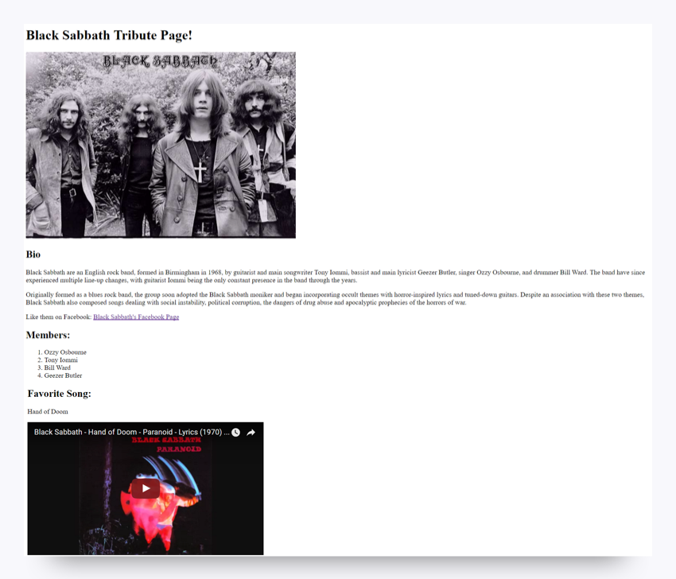

# My Favorite Musician

In this activity, you'll pay tribute to your favorite musician or band by building a simple fan page. That's right—you're about to code a website from scratch!

For this task, you'll use HTML to build out your page. It might not look amazing, but where would you be without a skeleton? If you get stuck, use Google to find what you need. Knowing how to learn new technologies on the fly is an important skill that all developers use—even experienced ones. Use this as an opportunity to practice that skill!

## Instructions

1. Open VS Code, create a new file, and save it as `fanpage.html`. It's important to include the `.html` extension so that VS Code knows what type of file it is and how to read it.

2. Create the structure for your page. Reference the panda website you just created. Be sure to include the `!DOCTYPE` declaration and the `<html>`, `<head>`, and `<body>` tags where appropriate.

3. Add content to your page. Your page can be about whatever musician or band you want, but it must include the following:

   * Proper page structure:

     * !`DOCTYPE` declaration

     * `<html>`, `<head>`, and `<body>` tags

     * A `<title>` for the page

   * At least one image (with an `alt` attribute)

   * A link to another website

   * An ordered or an unordered list (favorite songs, albums, band members, etc.)

   * A bio section with `
` tags for formatting

   * Use of `<h1>` and `<h2>` tags for headings

   * A video of the musician or band singing or playing a song

   * Proper indentation

Your finished page should look something like one of the following examples:

4. Upload your `fanpage.html` file.

## Helpful Hints

* To see how the page looks, right-click on the screen in VS Code and click "Open in Browser".

* If you get stuck, consult the resources provided at the end of the previous page.

* If you're still stuck, remember that Google is your friend!

## Bonus

* Make your link(s) open in a new tab.

* Add a favicon to your site (the little icon that appears on the browser tab).

* Make a table.

## Prework Support

Looking for prework support? Our team of tutors are eager to help! Request a tutor session by selecting the Student Support tab on the left and filling out the form.

---
© 2022 edX Boot Camps LLC. Confidential and Proprietary. All Rights Reserved.