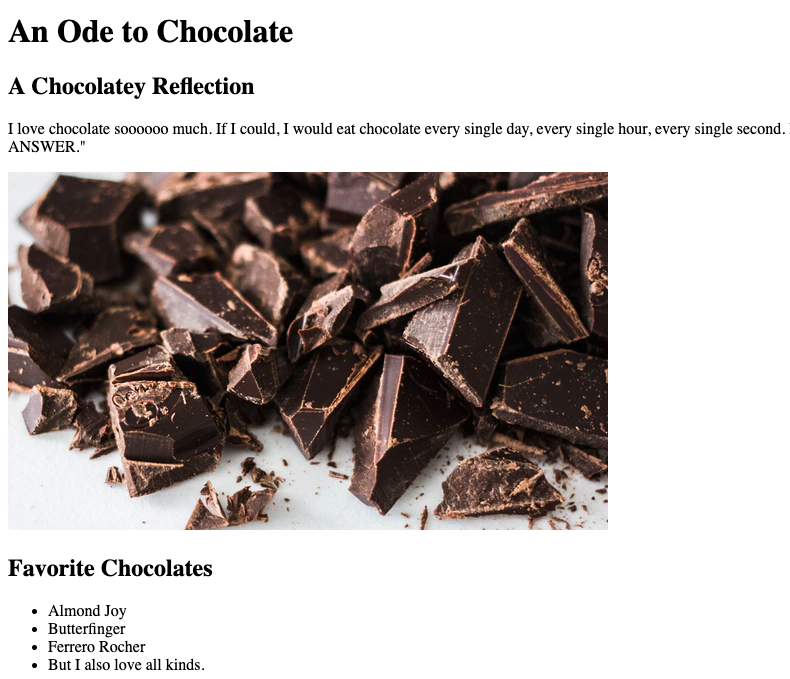
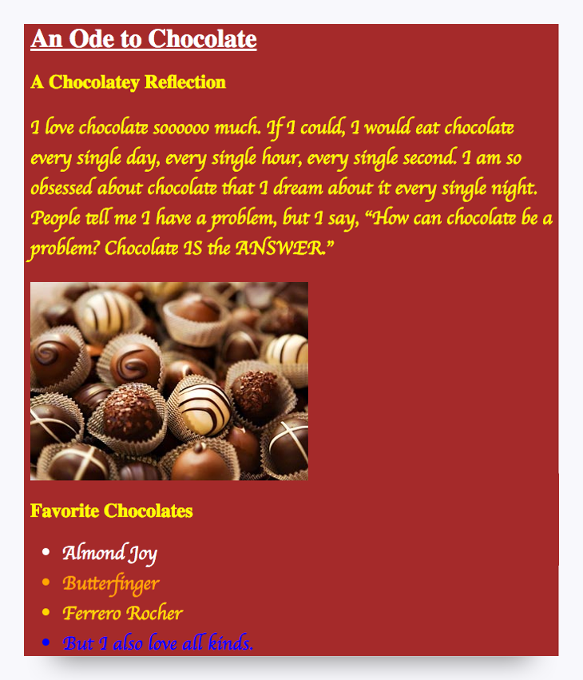
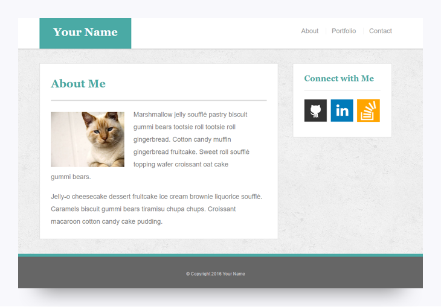

# 2.4.1 CSS Basics

Now that you've practiced creating basic HTML, it's time to learn about CSS. With the power of CSS, you can apply a variety of styles to your HTML and take your webpages to the next level.

## What Is CSS?

**Cascading Style Sheets**, or **CSS**, is a style sheet language that describes the presentation of a webpage. To continue the example from the previous lesson, if HTML is the skeleton of a webpage, then CSS is the meat on the bones. Whereas HTML strictly pertains to webpage markup, CSS deals with colors, aesthetics, and visual layout. It hooks onto specific elements of an HTML page and formats them using any number of style options.

However, jumping into CSS isn't always straightforward. As it often goes in web development, formatting visual styles on a website requires an explicit level of detail and a precise command of the language. Remember that creating web applications isn't a drag-and-drop process; colors, aesthetics, fonts, and visual layouts all need to be coded in order for every browser to consistently render the page correctly.

## Setting Up the HTML

To begin our exploration of CSS, we'll need to create a starting HTML file. We'll use the following one as an example:

```html
<!DOCTYPE html>
<html lang="en">
<head>
    <meta charset="UTF-8">
    <title>Ode to Chocolate</title>
</head>
<body>

<h1>An Ode to Chocolate</h1>

<h2>A Chocolatey Reflection</h2>

<p>I love chocolate soooooo much. If I could, I would eat chocolate every single day, every single hour, every single second. I am so obsessed about chocolate that I dream about it every single night. People tell me I have a problem, but I say, "How can chocolate be a problem? Chocolate IS the ANSWER."</p>


<h2>Favorite Chocolates</h2>
<ul>
    <li class="almond">Almond Joy</li>
    <li class="butterfinger">Butterfinger</li>
    <li class="ferrero">Ferrero Rocher</li>
    <li class="all">But I also love all kinds.</li>
</ul>

</body>
</html>
```

If you copy this code into Visual Studio Code, save it as an HTML file, and then load it into your browser, you should see a webpage that looks something like the following image:



Not bad. But sort of boring.

We might suspect that the author of this webpage would like a more chocolate-colored theme.

## Enter CSS

This is where CSS comes in! With a few extra lines of code, we can completely change the background color, font sizes, and text colors of the website.

Add the following code inside the `<head>` tag:

```html
<head>
  <style>

    body {
      background-color: brown;
    }

    h1 {
      color: white;
      text-decoration: underline;
    }

    h2, h3, p {
      color: yellow;
    }

    p, li {
      font-size: 24px;
      font-family: cursive;
    }

    .almond {
      color: white;
    }

    .butterfinger {
      color: orange;
    }

    .ferrero {
      color: gold;
    }

    .all {
      color: blue;
    }

  </style>
</head>
```

Once we save the HTML file again, the layout will look like the following image:



Much better!

## How CSS Works

If you spend a few minutes looking at the new code, you'll notice a consistent syntax, like the following example:

`HTML-TAG {
    CSS-PROPERTY: VALUE
}`

In effect, this code is referencing specific HTML elements and then applying changes to how they're formatted. The format options are called **properties** in CSS, and they can be modified in various specific ways. Don't expect to memorize all of the formatting options available through CSS. For many of your early weeks and months as a developer, you'll need to continually reference websites—like [W3Schools](http://www.w3schools.com/css/), among others—to find the exact syntax.

Believe it or not, you can build complex web layouts like the following one through simple HTML and CSS alone:



## What Are Classes?

If you were paying close attention, you may have noticed that certain HTML elements in the last example included a mysterious use of the word **class**. You used classes throughout the list of your favorite chocolates, as you can see here:

`<ul>
  <li class="almond">Almond Joy</li>
  <li class="butterfinger">Butterfinger</li>
  <li class="ferrero">Ferrero Rocher</li>
  <li class="all">But I also love all kinds.</li>
</ul>`

[Classes](http://www.w3schools.com/cssref/sel_class.asp) (along with [IDs](http://www.w3schools.com/cssref/sel_id.asp)) enable us to style multiple (or specific) HTML elements using the same CSS. We'll talk a lot about classes and IDs during the program, but it's helpful to have some exposure in advance.

To get you started, this next activity will give you some practice in styling HTML using CSS selectors like classes and HTML tags.

## Resources

* [CSS Introduction](http://www.w3schools.com/css/css_intro.asp)

* [Learn CSS—Crash Course #1](https://www.youtube.com/watch?v=dAUncsVxdvo)

* [Introduction to CSS](https://www.codeschool.com/courses/css-cross-country)

---
© 2022 edX Boot Camps LLC. Confidential and Proprietary. All Rights Reserved.