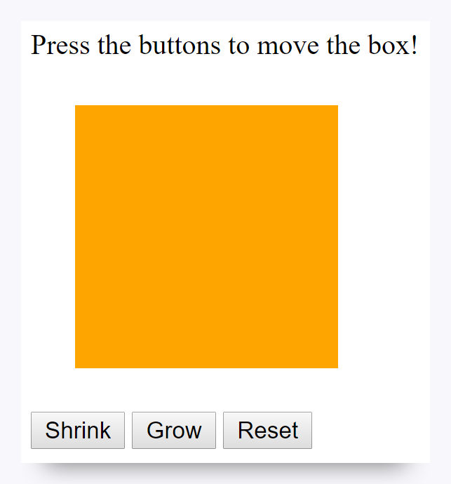
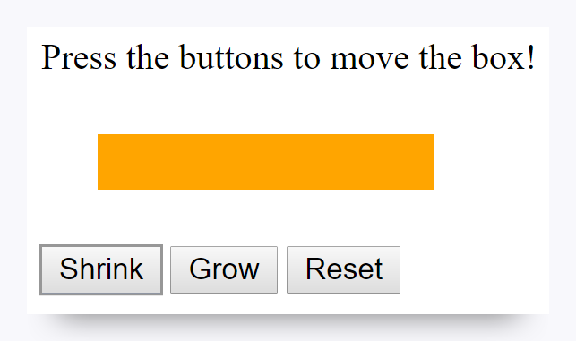

# 2.5.1 JavaScript Basics

You've covered a lot already, and now it's time to take your next big step! Using JavaScript, you can power your websites with effects, interactivity, data communication, and much more. In this boot camp, you'll spend nearly 15 weeks on JavaScript alone. It's a critical tool in every web developer's arsenal, so let's take an introductory look now.

## The Joys of JavaScript

**JavaScript** (or JS for short) is a high-level, dynamic programming language that underpins the web. JavaScript, along with HTML and CSS, is one of the core technologies that make our web experience what it is.

Like C++, Java, Ruby, and Python, JavaScript is written with all the features you'd find in a complete programming language, including variables, conditionals, loops, functions, and so much more. We'll use JavaScript extensively to create the logic that defines the behavior of web applications.

## How to Work with JavaScript

While the full power of JavaScript goes beyond the scope of this prework, let's get a small taste of what's possible.

Go ahead and open VS Code and create a new file called `index.html`. Copy the following code into this file and save it somewhere on your computer:

```html
<!DOCTYPE html>
<html>
<head>
    <title>Jiggle Into JavaScript</title>
</head>
<body>

    <p>Press the buttons to move the box!</p>

    <div id="box" style="height:150px; width:150px; background-color:orange; margin:25px"></div>

    <button id="shrinkBtn">Shrink</button>
    <button id="growBtn">Grow</button>
    <button id="resetBtn">Reset</button>

    <script type="text/javascript">

    </script>

</body>
</html>
```

If you view this page in the browser, you should see a page that looks like the following image:



Pretty fancy!

But if you try clicking the buttons, you'll realize that they have no impact on the position of the box. That's no fun whatsoever! This is where JavaScript comes in.

Copy the following code, paste it over the previous code in your HTML file, and save your file again.

```htm
<!DOCTYPE html>
<html>
<head>
    <title>Jiggle Into JavaScript</title>
</head>
<body>

    <p>Press the buttons to move the box!</p>

    <div id="box" style="height:150px; width:150px; background-color:orange; margin:25px"></div>

    <button id="shrinkBtn">Shrink</button>
    <button id="growBtn">Grow</button>
    <button id="resetBtn">Reset</button>

    <script type="text/javascript">

        document.getElementById("shrinkBtn").addEventListener("click", function(){

            document.getElementById("box").style.height = "25px";

        });

        document.getElementById("growBtn").addEventListener("click", function(){

            document.getElementById("box").style.height = "250px";

        });

        document.getElementById("resetBtn").addEventListener("click", function(){

            document.getElementById("box").style.height = "150px";

        });

    </script>

</body>
</html>
```

Now open the file once again in the browser.

This time, clicking the buttons will lead to changes in box height.



## The Magic Behind JavaScript

So, how did that work?

The essence of this interactivity sits between the two `script` tags on lines 16 and 36. There you'll see a series of code blocks responsible for the changes being made. Let's dissect the components:

* The lines each begin with `document.getElementById`. In a way, this is simply a reference to say, "If you click the button with an ID that matches, then do something." These IDs (e.g., `shrinkBtn`, `growBtn`, and `resetBtn`) correlate with the IDs of the buttons in the HTML.

* The lines then continue to say that we'll `addEventListener("click"...)`. This effectively means that the code will listen for any clicks on the targeted buttons.

We then open a `function` with some code inside. This code targets the `box` ID and restyles the height to an arbitrary pixel size. In a way, we're using JavaScript to dynamically change the CSS of the box in response to button clicks.

While the syntax might seem scary, the concepts are simple. Take a few moments to experiment some more. Take a look at this [table of changes](http://www.w3schools.com/jsref/dom_obj_style.asp) you can make using the `document.style` syntax we're using.

## Is That All?

Unfortunately, this simple example doesn't even scratch the surface. You can build truly powerful web applications through JavaScript, with complex user interfaces, dynamic data visualizations that reload as they update, geolocation tools, and more. JavaScript can do so much, so come prepared to have your mind blown repeatedly over the course of the boot camp.

## Your Turn!

Now try your hand at JS. For the next assignment, you'll take your elementary knowledge of JavaScript to create a box-modifying application similar to the one shown. The syntax might be tricky, but with a little persistence, you'll be box-changing in no time!

## Resources

* [JavaScript Introduction](http://www.w3schools.com/js/js_intro.asp)

* [Introduction to JavaScript](https://www.codecademy.com/learn/javascript)

* [JavaScript](https://www.codeschool.com/learn/javascript)

---
© 2022 edX Boot Camps LLC. Confidential and Proprietary. All Rights Reserved.