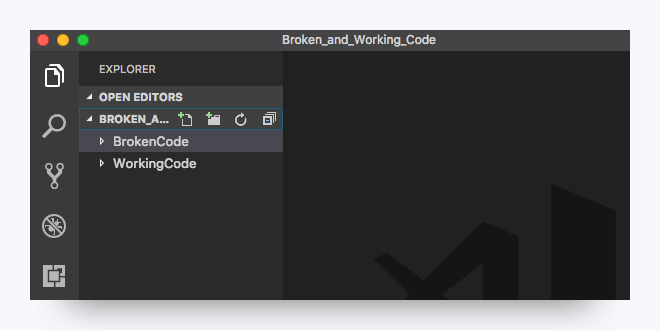
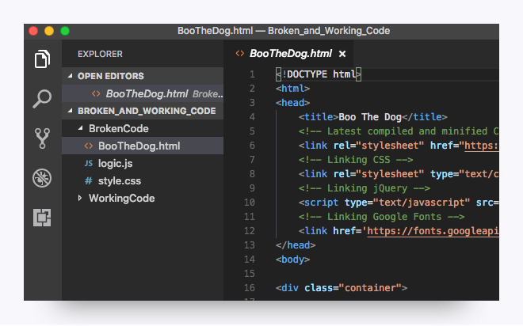

# Spot the Differences

In this assignment, you'll fix Boo the Dog's website, using only the limited information you have and a working reference example. This is a challenging activity. Be prepared to spend five hours or more on this activity if you're new to coding.

You might not familiar or comfortable with HTML, CSS, and JavaScript, but try not to get caught up in that fact. Instead, treat this activity as a simple game of spotting the differences. This activity may take time, but it resembles what your first few months in the program will look like. The sooner you get comfortable spotting bugs, the less stressed you'll be as a web developer.

## Before You Begin

1. Download [the complete code](https://drive.google.com/file/d/1IobMd1a6aYx7EW5VssZWAk-mM-J_IV7j/view).

2. Move the folder to somewhere accessible on your computer, such as your desktop.

3. [Unzip](https://www.wikihow.com/Unzip-a-File) the folder. You'll see that it creates a folder titled `Broken_and_Working_Code`, which holds two subfolders: `BrokenCode` and `WorkingCode`.

4. Open VS Code.

5. Drag the entire unzipped `Broken_and_Working_Code` folder into your VS Code editor. (Alternatively, you can click File and Open and select the unzipped `Broken_And_Working_Code` folder.)

6. Activate VS Code's explorer pane (if it isn't already active) by clicking View and then Explorer, or by clicking the file icon on the left sidebar. This will reveal a sidebar that allows you to flip between the `BrokenCode` and the `WorkingCode` folders, as shown here:

## Instructions

1. In VS Code, select the file `GrumpyCat.html` in the `WorkingCode` folder to view the code.

2. Right-click on the screen and then click "Open in Browser". This will show you the HTML page in your browser.

3. Once in the browser, take a few moments to get familiar with how the page looks and functions. Click on the various buttons to understand the effect they have on the page.

4. Return to VS Code and select the file `BooTheDog.html` in the `BrokenCode` folder. Use the same process to open this file in the browser.

5. Once in the browser, take a few moments to get familiar with the page. You'll quickly discover that each of the panels has something that's broken—either buttons that fail to work or content that isn't rendering correctly.

6. For the remainder of this assignment, your task is to flip between the files in the `BrokenCode` folder and the `WorkingCode` folder to identify differences that may be the cause for the broken functionality.

7. As you identify issues, note the errors in a document or on a piece of paper. You should then correct the code in the `BrokenCode` files and save those files. Refresh the file in the `BrokenCode` folder in your browser. If your changes were successful, you should see working functionality. If not, go back to the drawing board!

8. Upload the HTML file, CSS file, and JavaScript file (3 files total) in the `BrokenCode` folder. Briefly describe each of the errors you found in the comments box.

## Helpful Hints

* This activity will challenge you; you won't find any shortcuts here. You need to dig in and find the differences.

* Each panel has at least one error. Possible errors include missing commas, improper element linking, and others. You'll need a discriminating eye to find each of the errors.

* As a starting point, take a few moments to fix the aesthetic formatting of the code in the `BrokenCode` folder (i.e., fix the indentation and line breaks between code). This will make things easier to compare.

If you have some coding experience under your belt, feel free to consult [Google Developer Tools](https://developers.google.com/web/tools/chrome-devtools/?hl=en).

## Prework Support

Looking for prework support? Our team of tutors are eager to help! Request a tutor session with the following steps:

1. Click on "Student Support" in the left-hand navigation

2. Fill out the form marked "How can we help?" by entering your name, email, and by selecting "Student"

3. Select "Pre-work Support" from under "Question Category", "Pre-work Assistance" under "Question Sub Category", and enter the issue you're having

---
© 2022 edX Boot Camps LLC. Confidential and Proprietary. All Rights Reserved.