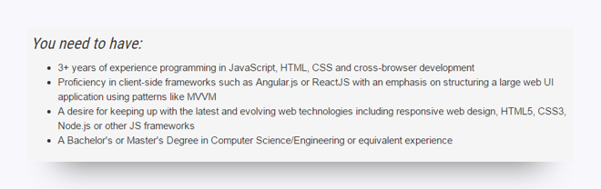

# Get Acquainted with Web Development

If you still need some help understanding the web development landscape, the following activity should clear things up.

In this activity, you'll use job sites like [Indeed](https://indeed.com/) and [Dice](https://dice.com/) to get acquainted with the web development field, via current job descriptions. This activity will help you start to contextualize the technologies you'll use in this course and beyond.

## Instructions

1. Go to a job site like [Indeed](http://www.indeed.com/) or [Dice](http://www.dice.com/).

2. Search for any of the following jobs:

    * Web developer

    * Front-end developer

    * Back-end developer

    * JavaScript developer

    * Node developer

3/ Read at least 10 job descriptions that result from your search. For each job description, make note of at least one term, tool, or technology with which you're unfamiliar. For example, in the following sample job description, you might choose Angular.js or ReactJS.

The following image shows the requirements for an example web developer job:

4. Search online for a definition or description of each term.

5. In your own words, define or describe each term you researched. You should have a total of 10 terms.

## Prework Support

Looking for prework support? Our team of tutors are eager to help! Request a tutor session with the following steps:

1. Click on "Student Support" in the left-hand navigation

2. Fill out the form marked "How can we help?" by entering your name, email, and by selecting "Student"

3. Select "Pre-work Support" from under "Question Category", "Pre-work Assistance" under "Question Sub Category", and enter the issue you're having

---
© 2022 edX Boot Camps LLC. Confidential and Proprietary. All Rights Reserved.